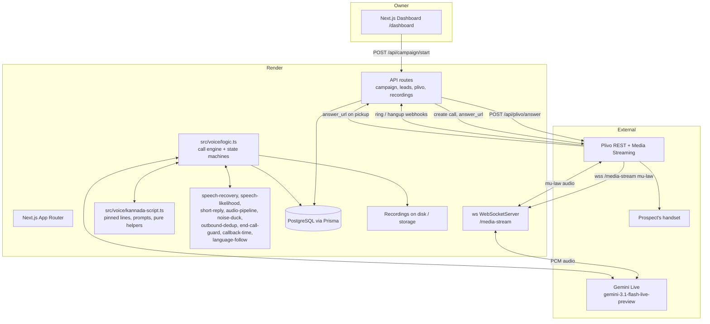

# Priya — Outbound Kannada Voice Agent for Alliance Square Properties

**Project specification and context document for AI coding agents**
Version 1.0 · Repository: `priya---alliance-square-properties` · Branch: `main` · Last commit at time of writing: `85376d8`

> **How to use this document:** paste it in full as the first message to any AI agent or coding assistant working on this repository. Every claim below is either (a) verified in the code, (b) recorded as an owner decision, or (c) explicitly marked `TODO` / `TBD` / `UNKNOWN` / `REQUIRES CLARIFICATION`. Do not treat unmarked statements as verified if they contradict the code — check the code.

---

## 1. Project Overview

Priya is an **outbound AI voice agent that places real phone calls, in Kannada, to prospective property buyers on behalf of Alliance Square Properties (Mysuru, Karnataka, India)**.

When a prospect answers, an AI voice agent named **Priya** conducts a short, disciplined sales conversation in Kannada: she asks whether the caller is looking for a plot in Mysuru, asks the caller's name, names the layouts/areas Alliance Square has, asks one interest question, and — if the caller is interested — hands the lead to the sales team and closes with a single thank-you before ending the call.

The entire product is one thing done extremely well: **a five-step outbound Kannada phone call that sounds like a real person, never leaves dead air, and never runs away from the script.**

| Attribute | Value |
|---|---|
| Product type | Outbound AI voice agent (telephony + realtime LLM audio) |
| Voice LLM | Google Gemini Live, model `gemini-3.1-flash-live-preview` (`src/voice/logic.ts:2411`) |
| Telephony | Plivo (outbound only; the number refuses inbound calls) |
| Deployment | Render.com, free plan, Singapore region, auto-deploy on push to `main` |
| UI | Next.js dashboard for leads, recordings, and campaign launch |
| Database | PostgreSQL via Prisma |
| Working directory | `saas-platform/` |

---

## 2. Purpose

Convert a cold-call list of prospective buyers into qualified, handed-off leads by having a consistent, polite, well-paced Kannada agent call each person, capture their interest, and route interested parties to the human sales team — while respecting the caller's time and ending the call cleanly.

---

## 3. Problem Statement

### 3.1 The business problem

Alliance Square sells residential plots in Mysuru. Reaching new buyers by phone is manual, inconsistent, and expensive. A human agent's call quality varies with mood and time of day; people answer the phone and immediately hear a sales pitch, hang up, and never call back.

### 3.2 The engineering problem (the real one)

Building an outbound voice agent that **sounds like a person on a phone call** is far harder than building a chatbot. The observed and fixed failure modes are:

1. **Dead air.** The agent speaks, asks a question, and then goes silent forever because a turn was generated but never delivered, or was dropped by a dedup/safety guard.
2. **Talking over the caller / going deaf.** Echo, background noise, and over-eager VAD thresholds cause the agent to stop listening, so quiet callers are ignored entirely.
3. **Cutting the caller off mid-sentence.** A naive "thank you ⇒ end of call" rule means any mid-call "thank you" from the caller mutes the agent while it is still speaking its own line.
4. **Improvised, drifting scripts.** Without a pinned, numbered script, the model invents extra questions, promises future steps, re-asks answered questions, oversells, and drags calls out.
5. **Calls that never end.** Ending a call reliably from a model turn is unreliable; the engine now owns ending.
6. **Invisible failures.** When a call misbehaves, nothing distinguishes "the trigger never fired" from "the provider rejected our request", and the host's logs are not readable.

Sections 19 and 22 document the mechanisms built to defeat each of these.

---

## 4. Goals

**G1.** Place outbound Kannada calls from a lead list via Plivo.
**G2.** Deliver a five-step, pinned, verbatim script that Priya follows exactly, in one calm even pace.
**G3.** Never leave the caller in dead air after any question she asks — if a turn produces no audible speech, the engine re-issues it.
**G4.** Always answer a caller who speaks, including a late reply that arrives while or after the goodbye is being spoken.
**G5.** End the call exactly once, after the closing thank-you finishes, never mid-sentence.
**G6.** Handle silence deliberately: check twice, then say a real goodbye and end.
**G7.** Persist call lifecycle, transcript, recording, and outcome to PostgreSQL and surface them in the dashboard.
**G8.** Keep every behavioural rule unit-testable as pure functions, with a verification script per fixed bug.
**G9.** Make the deployed build identifiable and diagnosable without access to host logs.

---

## 5. Non-Goals

These are **explicitly out of scope**. Do not implement them as part of ongoing work.

- **N1. Inbound calling.** The Plivo number hangs up immediately on inbound (`src/app/api/plivo/answer/route.ts`). Do not add an inbound agent.
- **N2. Sentiment analysis.** Explicitly removed from platform and backend (`AGENTS.md`). Do not reintroduce.
- **N3. Live per-turn summary writes.** The `summary` field is written once at call end, not updated turn-by-turn during the call.
- **N4. Google Calendar / external scheduling.** "Scheduled" means recorded internally and shown in the portal's calendar widget only.
- **N5. Rebooking, multi-campaign orchestration, or lead scoring models.** Not built, not requested.
- **N6. A general-purpose voice platform.** The Gemini Live API exposes no rate, pitch, or SSML controls (`buildLiveSpeechConfig` sets only `voiceName` and an optional `languageCode`). Prosody is controlled **only through prompt text**.
- **N7. Rewriting working call-flow behaviour.** The existing conversation flow is a product decision; changes require explicit owner instruction.

---

## 6. Background and Context

- The repository is a merged/derived Next.js "SaaS platform" (`saas-platform/`) that originally used Twilio; telephony has been migrated to **Plivo**. Twilio env vars still exist in `.env.example` for legacy reasons — see §26 Conflicts.
- Documents that already exist in the repo and are **part of the product contract**: `saas-platform/AGENTS.md` (platform features + constraints) and `saas-platform/PRIYA_GUARDRAILS.md` (agent behavioural rules, marked DO NOT MODIFY WITHOUT EXPLICITLY REQUEST). `saas-platform/docs/` holds the source content the call script is derived from.
- A prior decision was made **against** multiple deploy targets: `railway.toml`, `fly.toml`, `vercel` remnants (`.vercel/`) and `Dockerfile` exist in the tree, but **Render is the deployment of record** (`render.yaml`). Treat the others as vestigial unless the owner says otherwise.
- GitHub → Render auto-deploy on push to `main`. Nothing is currently committed or pushed beyond `85376d8`; there are uncommitted working-tree changes (see §25).

---

## 7. Product Requirements

**P1. One real outbound call per dialled lead.** Plivo `answer_url` fires only on pickup, which is what moves a lead `calling → answered`.
**P2. The call is a five-step pinned script.** Step 1 site question → step 2 name → step 3 projects + one interest question → step 4 (only if interested) sales-team handoff line + one thank-you → step 5 stop talking; line goes quiet; call ends. There is no sixth step.
**P3. Pinned lines are spoken word for word.** Opening, name question, areas line, and the thank-you close are fixed Kannada strings in `kannada-script.ts`. Only the interest question may be reworded in the caller's language.
**P4. One calm, even pace for the entire call.** No speeding up, slowing down, trailing off, or matching the caller's energy.
**P5. Dead air is a defect, never a behaviour.** After any pinned question, the engine guarantees audible speech or a repair.
**P6. A late reply is always answered.** A caller who speaks 3–5 seconds late cancels the pending goodbye and is answered.
**P7. Silence has a defined ladder:** check at 5s, check again 5s later (identical line), then a real goodbye and end ~5s after the second check.
**P8. The call ends once, 1 second after the closing thank-you has finished playing** (audio-settle 350 ms, hard cap 8 s).
**P9. Interest is captured, and interested leads are visible** on the dashboard's Confirmed tab with recording and transcript.
**P10. The deployed build is identifiable** at runtime without host logs.

---

## 8. Functional Requirements

### 8.1 Campaign launching

- **FR1.** `POST /api/campaign/start` with `{ campaignId }` dials every lead in the campaign whose status is not in `SKIP_DIAL_STATUSES` (`calling`, `answered`, `visit scheduled`) and not the legacy `'scheduled visit'`, ordered by `createdAt` ascending.
- **FR2.** Before dialling, it calls `releaseCallingLeadsForRedial(campaignId, liveTails)` so leads stuck in `calling`/`answered` from missed webhooks become dialable again — except numbers currently live on Plivo (fetched from `https://api.plivo.com/v1/Account/{authId}/Call/?status=live&limit=20`).
- **FR3.** It **refuses** to dial unless `VOICE_SERVER_URL`/`APP_URL` is a public HTTPS URL that is not `localhost`, `127.0.0.1`, or an `ngrok` host. Response `500` with a clear error otherwise.
- **FR4.** Phone normalisation: 10 digits → `+91…`; 12 digits starting `91` → `+91…`; 11 digits starting `0` → `+91…` without the trunk `0`; otherwise `+` + digits.
- **FR5.** Per lead it POSTs to `https://api.plivo.com/v1/Account/{authId}/Call/` with `from = PLIVO_PHONE_NUMBER`, `to = <E164>`, `answer_url = {appUrl}/api/plivo/outbound?customerName=…&customerPhone=…` (`answer_method: POST`), `hangup_url` and `ring_url` = `{appUrl}/api/plivo/status` (`POST`).
- **FR6.** On success the lead is marked `calling`, with `calledFrom` and `lastCalledAt` set. On failure the lead is transitioned to `failed` and the per-lead error is returned in `results`.
- **FR7.** Response shape: `{ success, called, failed, results: [{id, phone, ok, error?}] , error? }`; HTTP `200` if at least one call succeeded, `502` if none did, `400` if no dialable leads, `500` on unexpected error.
- **FR8.** Nothing is dialled unless a human pressed Launch Campaign. **An agent must never initiate a call programmatically.**

### 8.2 Call answering and media streaming

- **FR9.** `POST /api/plivo/outbound` returns Plivo XML containing exactly one bidirectional `<Stream>` with `contentType="audio/x-mulaw;rate=8000"`, `extraHeaders` carrying `isOutbound=true;customerPhone=…;customerName=…` (spaces in the name replaced with `_`, max 60 chars), and a `wss://{wsHost}/media-stream?isOutbound=true&customerPhone=…&customerName=…` URL.
- **FR10.** `keepCallAlive="true"` is mandatory. With `false`, Plivo ends the call ~2 s after the XML is consumed (hangup cause `End Of XML Instructions`) and the agent never gets to speak. This was measured on a live call.
- **FR11.** `wsHostFromRequest()` prefers `VOICE_SERVER_URL`, then `APP_URL`, then the request `Host`, skipping localhost/ngrok/vercel hosts.
- **FR12.** The answer route pre-warms the outbound opening instruction via `cacheOutboundOpeningInstruction(phone, name)` so the first spoken turn is not waiting on prompt construction.
- **FR13.** On answer, the lead is transitioned to `answered` by phone (`markAnsweredByPhone`).
- **FR14.** `POST /api/plivo/answer` (inbound) always returns `<Response><Hangup /></Response>`. This is deliberate and permanent.

### 8.3 WebSocket media stream

- **FR15.** `server.ts` runs Next.js in-process via `next({ dev })` and attaches a `ws` `WebSocketServer` with `noServer: true`, handling only the `/media-stream` upgrade path.
- **FR16.** `server.ts` loads env in this order with `override: true` for the first: `saas-platform/.env`, then `../.env.local`, then `../.env`.
- **FR17.** On connection it derives a trustworthy public base URL from `x-forwarded-proto` + `Host` (Render terminates TLS in front) and passes it to `setupGemini(ws, searchParams, { publicBaseUrl })`. This matters because the hangup callback URL must be reachable by Plivo, and a stale env var silently killed every remote hangup.
- **FR18.** `setupGemini` mu-law decodes the 8 kHz audio, runs it through the audio pipeline (high-pass → adaptive noise gate → gain), and streams it to Gemini Live; Gemini's audio is re-encoded to mu-law and written back to Plivo.
- **FR19.** The session is opened with `model: "gemini-3.1-flash-live-preview"` and the config from `buildLiveSpeechConfig()` (`src/voice/tts/speech-config.ts`).

### 8.4 Call outcome and hangup

- **FR20.** Ending the call is done through Plivo's own CDR (`hangupCallLegViaPlivoApi` in the hangup route), not by relying on a model tool call. The real `CallUUID` captured from the start event is required.
- **FR21.** `armOutboundCloseDeadline(reason, ms = 25_000)` guarantees a hangup attempt even if the model's own trigger never fires; `clearOutboundCloseDeadline()` cancels it when a new turn takes ownership; `forceOutboundHangupIfClosing(reason)` forces the attempt.
- **FR22.** `GET /api/plivo/hangup-status` is a read-only diagnostic publishing `build` (currently `hangup-status/6`), `aleg.count` (incremented by Plivo itself each time it fetches the `<Hangup/>` XML), the last hangup action, whether Plivo credentials are configured, and `plivo.authIdHash` (first 12 hex chars of SHA-256 of the auth id — never the token). Existence of this endpoint proves the new build is deployed; 404 proves it is not.
- **FR23.** `GET /api/plivo/status` is the Render health check path.

### 8.5 Lead persistence

- **FR24.** Lead status is a **three-field model**: legacy composite `status`, independent `callStatus` (call lifecycle), and `outcomeStatus` (customer intent, or the literal `unknown`). `composeLegacyStatus()` keeps `status` in sync.
- **FR25.** `LEAD_STATUS` values: `pending`, `calling`, `answered`, `call completed`, `interested`, `follow up`, `visit scheduled`, `not interested`, `not answered`, `call ended`, `failed`. `OUTCOME_STATUSES` = `interested`, `follow up`, `visit scheduled`, `not interested`. `OUTCOME_UNKNOWN = 'unknown'`.
- **FR26.** `normalizeLeadStatus()` maps legacy spellings: `not - interested` → `not interested`, `scheduled visit` → `visit scheduled`, `completed` / `call complete` → `call completed`, `idle` → `pending`. Unknown input falls back to `pending`.
- **FR27.** All transitions go through `transitionLeadsByPhone` / `transitionLeadById`, which match on the **last 10 digits** of the phone and are **idempotent** — duplicate webhooks are safe because only rows whose current status is allowed to reach the target (including already being at it) are updated.
- **FR28.** `setDualStatusById()` is the admin/UI path for setting `callStatus` and `outcomeStatus` independently, then composing the legacy field. It also maintains the `interested` boolean.
- **FR29.** `applyProviderTerminalStatus(phone, hint)` maps a provider hangup to a terminal status, preferring `not answered` when duration is `0` and the lead never reached `answered`.
- **FR30.** `releaseCallingLeadsForRedial()` and `releaseStaleCallingLeads(campaignId, staleMs = 3min)` unstick leads whose webhooks never arrived. `scripts/reset-stuck-leads.mjs` exists for manual recovery.
- **FR31.** `assertCanTransition(from, to)` throws on an illegal transition and is the guard for the transition table.
- **FR32.** Persisted per call: `transcription`, `recordingUrl`, `lastResponse`, `summary` (written at call end only), `duration`, `interested`, `appointmentTime`, `calledFrom`, `lastCalledAt`.

### 8.6 Dashboard

- **FR33.** `/dashboard` (root `/` 307-redirects here) contains: **Launch Campaign** (dials all leads — destructive, human-initiated only), **Add Lead**, **Recordings**, **Overview** and **Confirmed** tabs, and an **All Leads** table. Status editing is dual-field via `src/components/dashboard/DualStatus.tsx`.
- **FR34.** `src/app/dashboard/recordings` and `src/app/api/recordings*` (list, `[callId]`, `[callId]/audio`) provide playback.
- **FR35.** The dashboard polls (two `setInterval`s, at `src/app/dashboard/page.tsx:80` and `:297`).

---

## 9. Non-Functional Requirements

| ID | Requirement | Status |
|---|---|---|
| NFR1 | No dead air after any question Priya asks. | Implemented (§24) |
| NFR2 | A caller who speaks at any point before hangup gets a response. | Implemented (§24) |
| NFR3 | The call never ends mid-sentence. | Implemented — `hasThanksClosing` mute is the main historical cause; see §22 |
| NFR4 | Exactly one hangup per call. | Implemented — close deadline + post-thanks scheduling |
| NFR5 | Behaviour must be unit-testable without a live call. | Enforced — pure helpers in `kannada-script.ts` / `speech-recovery.ts` |
| NFR6 | Database writes must not be high-frequency; `AGENTS.md` mandates avoiding writes under 500 ms apart to prevent lock contention, with retry loops. | Observed in routes; retry count/lock handling: `TBD` (Supabase Postgres is configured, not SQLite) |
| NFR7 | Use the singleton Prisma client from `@/lib/prisma`; never `new PrismaClient()`. | Observed |
| NFR8 | Build must succeed on Render's free plan: `NODE_OPTIONS=--max-old-space-size=4096` at build, `460` at runtime. | Observed in `render.yaml` |
| NFR9 | Secrets must never be exposed by any endpoint. | Enforced by `hangup-status` (hash only) |
| NFR10 | Performance target (latency budgets, max concurrent calls): **TBD — never established.** | Unknown |

---

## 10. User Experience Requirements

### 10.1 For the caller (the prospect)

- **UX1.** The call opens immediately and naturally in Kannada; no long silence, no hold music, no "please hold" loop.
- **UX2.** Exactly one calm, even, close-mic, warm-but-understated pace for the whole call.
- **UX3.** Every question is asked once, and every answer is acknowledged before moving on.
- **UX4.** Priya never says her own name twice, never re-asks the site question, never promises to explain something later, and never says "thank you" except in the closing (saying it mid-call ends the call on this system).
- **UX5.** If the caller is quiet, Priya checks twice with the same line, then says a genuine goodbye and ends. She never hangs up abruptly.
- **UX6.** If the caller speaks late — including during the goodbye — the goodbye is cancelled and they are answered.
- **UX7.** If the caller switches language, Priya follows their language immediately without asking. Switching must be **caller-initiated only**.

### 10.2 For the owner (the operator)

- **UX8.** Add a lead, launch a campaign, watch leads, play recordings, and mark a lead interested/not-interested, all from one dashboard.
- **UX9.** Launch Campaign dials **every** dialable lead immediately. There is no dry-run, rate limit, or confirmation step. **This is a known footgun** — see §36.
- **UX10.** The operator must be able to tell whether a misbehaving call is a local build problem or a deployed build problem, from a single HTTP GET.

---

## 11. System Architecture



**Architectural shape (observed).** A single Node process hosts both the Next.js HTTP server and the WebSocket media stream (`server.ts`). All voice behaviour lives in one long-lived per-call closure inside `setupGemini` (`src/voice/logic.ts`, ~3694 lines) holding mutable call state as module-scope `let` variables. Script text, prompts, and **pure decision helpers** live separately in `src/voice/kannada-script.ts` (~1847 lines) so they can be unit-tested without a call. Supporting subsystems are small focused modules. API routes are thin: they call `src/lib/lead-status-transitions.ts` and never touch the engine directly.

---

## 12. Technology Stack

| Layer | Technology | Evidence |
|---|---|---|
| Language | TypeScript (`typescript ^5`) | `tsconfig.json` |
| Runtime | Node ≥ 20 locally; Node 22.13.0 on Render | `package.json` `engines`, `render.yaml` |
| Web framework | Next.js `16.2.3` (App Router) | `package.json` |
| UI | React `19.2.4`, `tailwindcss ^4`, `lucide-react`, `motion` | `package.json` |
| Realtime voice LLM | `@google/genai ^1.29.0`, model `gemini-3.1-flash-live-preview` | `logic.ts:2411` |
| Telephony | Plivo REST + bidirectional media streaming | `src/app/api/plivo/*` |
| WebSocket | `ws ^8.20.0`, attached to the Next HTTP server | `server.ts` |
| Database | PostgreSQL via `@prisma/client ^5.22.0` | `prisma/schema.prisma` |
| Env loading | `dotenv ^17.4.2` | `server.ts` |
| Test runner | `node:test` via `tsx --test` | `"test": "tsx --test src/voice/__tests__/*.test.ts"` |
| Excel import | `xlsx ^0.18.5` | `package.json` |
| Deploy | Render (Node, free, Singapore), GitHub auto-deploy on `main` | `render.yaml` |
| Local dev launcher | `scripts/start-dev-hidden.vbs` (hidden window, kills prior :3000 holder) | `scripts/` |
| Lint | `eslint ^9` + `eslint-config-next` | `eslint.config.mjs` |

---

## 13. Project Structure

```
priya---alliance-square-properties/
├── .env.example, .env.local, .gitignore, package.json, render.yaml
└── saas-platform/
    ├── AGENTS.md                  # platform features + constraints (product contract)
    ├── CLAUDE.md
    ├── PRIYA_GUARDRAILS.md        # agent behaviour rules — DO NOT MODIFY without request
    ├── PROJECT_SPECIFIC_CONTENT.md
    ├── server.ts                  # Next + ws in one process; /media-stream upgrade
    ├── render.yaml                # deployment of record
    ├── Dockerfile, fly.toml, railway.toml, .nvmrc   # vestigial (see §6, §26)
    ├── prisma/schema.prisma       # User, Campaign, Lead
    ├── docs/                      # this spec + REVISED_CONTENT_FOR_AI.md + source PDF
    ├── scripts/                   # verify-*.mjs, list-plivo-calls, reset-stuck-leads,
    │                              # start-dev-hidden.vbs, flow-test.ts, probe-media-stream.mjs
    ├── call_logs/, recordings/, voice-lab/, server-dev.log
    └── src/
        ├── app/
        │   ├── page.tsx           # 307 → /dashboard
        │   ├── dashboard/         # page.tsx (~1112), recordings/
        │   └── api/
        │       ├── campaign/start/route.ts
        │       ├── leads/route.ts, leads/ensure, leads/upload
        │       ├── plivo/{outbound,answer,hangup,hangup-status,status,transfer-answer,transfer-status}
        │       └── recordings/{route.ts,[callId]/route.ts,[callId]/audio/route.ts}
        ├── components/dashboard/  # Shell.tsx, Sidebar.tsx, DualStatus.tsx
        ├── lib/                   # prisma.ts, lead-status.ts, lead-status-transitions.ts,
        │                          # lead-upsert.ts, call-summary.ts, recordings.ts
        ├── voice/
        │   ├── logic.ts           # the engine (~3694 lines) — CRLF
        │   ├── kannada-script.ts  # pinned lines, prompts, pure helpers (~1847) — CRLF
        │   ├── audio-pipeline-config.ts, noise-duck.ts, speech-likelihood.ts
        │   ├── speech-recovery.ts, short-reply.ts, turn-policy.ts
        │   ├── end-call-guard.ts, outbound-dedup.ts, callback-time.ts
        │   ├── opening-prewarm-cache.ts
        │   ├── Outbound/callguide.ts
        │   ├── tts/speech-config.ts
        │   ├── language/{language-follow.ts, script-detect.ts}
        │   ├── call-capture/{session,recorder,stt,conversation-log,logger,config}.ts
        │   └── __tests__/*.test.ts   (12 files, 194 tests)
        └── app/dashboard/page.tsx
```

**Line-ending fact (matters when editing):** `kannada-script.ts`, `logic.ts`, and `kannada-script.test.ts` are **CRLF**; `owner-decisions.test.ts`, `language-follow.test.ts`, and `language/language-follow.ts` are **LF**. Mixing or normalising wholesale produces huge diffs.

---

## 14. Core Components

### 14.1 `src/voice/logic.ts` — the call engine (observed)

Holds the whole per-call state machine inside `setupGemini`. Key regions:

| Concern | Location (approx.) |
|---|---|
| mu-law codec tables | ~L307 |
| `setupGemini` entry | ~L334 |
| Tool definitions (`OUTBOUND_END_CALL_TOOL`, `NOT_INTERESTED_TOOL`, `SET_CALLBACK_TIME_TOOL`) | ~L231–L307 |
| `handleNameStep` (arms the speak guard) | ~L922 |
| `shouldSuppressOutboundTurn` (reasons that advance the step: `echo_confirm`, `future_pitch`, `duplicate_within_turn`) | ~L1098 |
| `playOutboundTurnIfNew` (stalled-turn re-issue, `outboundAreasLineHeard`) | ~L1207 |
| `sendPcmToTwilio` (clears the step audio guard after `lastAiAudioAt = Date.now()`) | ~L1340 |
| Speech-recovery ladder wiring | ~L1440–1560 |
| Close deadline: `armOutboundCloseDeadline` / `clearOutboundCloseDeadline` / `forceOutboundHangupIfClosing` (`OUTBOUND_CLOSE_DEADLINE_MS = 25_000`) | ~L1865–1890 |
| `runOutboundSilenceTick` (hold + records goodbye timestamp) | ~L1990 |
| `armOutboundSilenceAfterTurn` | ~L2060 |
| `cancelSilenceCloseIfCallerSpeaks`, `armOutboundStepAudioGuard` | just after ~L2060 |
| Runtime instruction block | ~L2180 |
| Gemini session config (`model`) | ~L2411 |
| Outbound transmit close detection | ~L2490 |
| Transcript handler (`cancelSilenceCloseIfCallerSpeaks('caller transcript')`, `nameStepHandled` ~L2757) | ~L2550 |
| Interested branch | ~L2890 |
| `endCall` guard | ~L2870 |
| VAD `lastCallerVoiceAt` | ~L3410 / ~L3431 |

### 14.2 `src/voice/kannada-script.ts` — script, prompts, pure logic

**Pinned lines (spoken word for word):**

| Constant | Value |
|---|---|
| `PDF_OPENING_INTRO_KN` | `ಹಲೋ, ನಾನು ಅಲೈಯನ್ಸ್ ಸ್ಕ್ವೇರ್‌ನಿಂದ ಪ್ರಿಯಾ.` |
| `PDF_OPENING_TURN1_KN` (= `PDF_OPENING_KN` = `PDF_OPENING`) | the site question line |
| `PDF_NAME_QUESTION_KN` | `ನಿಮ್ಮ ಹೆಸರು ಏನು?` — neutral: no honorific before the name is known |
| `PDF_AREAS_LINE_KN` | the projects/areas substance |
| `PDF_INTEREST_QUESTION_KN` | the one interest question (may be reworded) |
| `PDF_ACK_KN` | `ಸರ್ತಿ` — one short acknowledgement, **must never** count as a thank-you |
| `PDF_HANDOFF_LINE_KN` | the sales-team handoff line |
| `PDF_THANKS_CLOSE_KN` | `ನಿಮ್ಗೆ ಸಮಯ ಕೊಡಿದಂತೆ ಧನ್ಯವಾದಗಳು ಸರ್.` |
| `SILENCE_CHECK_LINE_KN` | `ಹಲೋ, ಇನ್ನೂ ಲೈನ್‌ನಲ್ಲಿ ಇದೀರಾ?` — neutral: it can fire before the name is known |
| `SILENCE_GOODBYE_LINE_KN` | the real goodbye |
| `HONORIFIC_SIR_KN` / `HONORIFIC_MAAM_KN` | `ಸರ್` / `ಮಾಮ್` |

**Prompt blocks (both placed at the top of the two instructions):** `FIVE_STEP_FLOW` (~L1290), `VOICE_DELIVERY` (~L1255), `LANGUAGE_RULES` (~L1330), `CALL_FLOW_RULES` (~L1410) with FIXED LINES + a ban on promising later steps, `DIRECTNESS_RULES`, `NO_ECHO_RULES`, `SCRIPT_FLOW` (~L1425). `buildOutboundFastConnectInstruction(currentDateStr)` (~L1530) and `buildOutboundSystemInstruction(...)` (~L1610) assemble them; `buildOutboundProjectReferenceContext()` (~L1748) injects the allowed layout names (`ALLOWED_LAYOUT_NAMES`, with `detectForbiddenLayoutMention`).

**Pure helpers (unit-testable):** `extractCallerName` (~L727, Kannada capture, `isOwnSpokenWord` filter, `KANNADA_FEMININE_NAMES` → honorific), `honorificForName` / `nameWithHonorific`, `looksLikeAnswerToSiteQuestion` (~L910), `looksLikeNameRefusal`, `looksLikeCantHearLine`, `looksLikeStutteredClose`, `looksLikeOpeningEcho` (in `short-reply.ts`), `looksLikeEchoConfirmQuestion`, `looksLikeCustomerBusy`, `looksLikeOpeningRestate`, `looksLikeAreasLine` (~L1098), `looksLikeHandoffLine`, `looksLikeNotInterestedCloseLine`, `looksLikeFutureSitePitch` (~L683), `looksLikeIdentityQuestion`, `looksLikeContextInterrupt`, `looksLikeCannotAnswerLine` (~L1810), `hasThanksClosing` (~L590), `looksLikeThanksOnlyLine`, `looksLikeClosingGoodbye`, `isRedundantOutboundThanksTurn`, `looksLikeRepeatRequest`, `shouldDropRepeatedThanksInTurn`, `deriveOutboundConversationMemory`, `squashScriptText`, `buildOutboundRepeatQuestionNudge`.

**Nudges (~L1114–1260 and ~L1338–1850):** `OUTBOUND_REPEAT_NUDGE`, `OUTBOUND_NO_REPEAT_NUDGE`, `OUTBOUND_NOT_INTERESTED_CLOSE_NUDGE`, `OUTBOUND_YES_LOCATIONS_NUDGE` (= `OUTBOUND_YES_ASK_NAME_NUDGE`), `OUTBOUND_NAME_QUESTION_NUDGE`, `OUTBOUND_NAME_QUESTION_RETRY_NUDGE`, `buildOutboundProjectsNudge`, `buildOutboundProjectsRetryNudge`, `buildOutboundNameDeclinedNudge`, `buildOutboundHandoffTransferNudge`, `OUTBOUND_THANKS_FALLBACK_NUDGE`, `OUTBOUND_CLEAN_CLOSE_NUDGE`, `OUTBOUND_CANNOT_ANSWER_NUDGE`, `buildOutboundCallbackTimeNudge`, `buildOutboundCallbackOutsideWindowNudge`, `OUTBOUND_SILENCE_CHECK_NUDGE`, `OUTBOUND_SILENCE_RESUME_NUDGE`, `OUTBOUND_SILENCE_CANCELLED_NUDGE`, `buildOutboundIdentityAnswerNudge`, `buildOutboundOffTopicAnswerNudge`, `buildOutboundResumeNudge`.

**Timing constants:**

| Constant | Value | Meaning |
|---|---|---|
| `SILENCE_CHECK_AFTER_MS` | `5_000` | first silence check |
| `SILENCE_CHECK_REPEAT_AFTER_MS` | `5_000` | second check (identical line) |
| `SILENCE_CLOSE_AFTER_CHECK_MS` | `5_000` | goodbye after the second check |
| `SILENCE_CHECKS_MAX` | `2` | checks before closing |
| `OUTBOUND_THANKS_AUDIO_SETTLE_MS` | `350` | wait for audio tail |
| `OUTBOUND_THANKS_AUDIO_WAIT_CAP_MS` | `8_000` | hard cap on that wait |
| `OUTBOUND_END_AFTER_THANKS_MS` | `1_000` | hangup after the thank-you finishes |
| `OUTBOUND_STEP_AUDIO_GUARD_MS` | `2_600` | re-issue window after a pinned question |
| `OUTBOUND_STEP_AUDIO_GUARD_MAX` | `2` | max repairs per question |
| `OUTBOUND_SILENCE_MAX_DEFERS` | `4` | max silence-close defers |
| `OUTBOUND_CLOSE_DEADLINE_MS` | `25_000` | forced hangup backstop |
| `CALLBACK_WINDOW_START_HOUR` / `_END_HOUR` | `10` / `19` | callback window 10am–7pm |

**Silence state machine (~L215–330):** `createOutboundSilenceState`, `armOutboundSilenceCheck`, `resetOutboundSilence`, `tickOutboundSilence`, `nextOutboundSilenceDeadline`, plus the newer pure helpers **`shouldHoldSilenceClose({now, lastCallerVoiceAt, lastSpeechEnergyAt, graceMs, defersUsed, maxDefers})`** and **`shouldCancelPendingSilenceClose({goodbyeSentAt, thanksSpoken, hardMute, transferStarted})`**. `postThanksHangupAction({...})` (~L401) decides the post-close action.

### 14.3 Supporting modules

- **`speech-recovery.ts`** — the "user spoke but nothing happened" failsafe. `loadRecoveryConfig()`: transcript grace **1100 ms**, escalate **1600 ms**, max **2** attempts. Stages `idle → grace → answerGrace → nudge`. Hard guarantees in its header: every confirmed caller speech end arms it; a dropped transcript gets a repeat request; a transcript with no AI audio gets an immediate reply; AI audio resolves it; a new speech start disarms it; **exhaustion ends in `resume_after_exhausted` — the ladder NEVER hangs up and NEVER hands off to a terminating path.** It replaced a separate response-watchdog so exactly one recovery system exists.
- **`speech-likelihood.ts`** — decides whether caller audio is speech vs. noise/echo, with gate and confidence thresholds; drives `lastCallerVoiceAt` and barge-in.
- **`audio-pipeline-config.ts`** — high-pass filter, adaptive noise gate, **fixed gain 4.5** (local; Render sets `VOICE_INPUT_GAIN=3.1`), `speechGateStartMs` **40** local / **60** on Render. Its header states the goal: a sharpest-hearing pipeline that still forwards a whisper at full scale while cutting background harder.
- **`noise-duck.ts`**, **`outbound-dedup.ts`** — suppress background noise; drop duplicate/repeated outbound turns before they reach the caller.
- **`short-reply.ts`** — `isShortAffirmativeReply` (anchored, ≤ 24 chars), `isLikelySttNoise`, `looksLikeOpeningEcho`, `isCustomerTurnSignal`.
- **`end-call-guard.ts`** — server-side refusal of premature `endCall` tool invocations: too short a call, no meaningful caller utterance, silence-only, opening-echo-only, `notInterested` not in the same tool batch, busy/callback-later close without a real conversation. `salesTeamClose` grants the model full authority to end in that same turn. A `silenceTimeoutClose` input was **removed** with the comment *"silence never authorizes ending a call."*
- **`callback-time.ts`** — callback window logic (10:00–19:00) and its outside-window line.
- **`language/language-follow.ts`** (LF) — caller-initiated language switching; Kannada/Telugu/Tamil/Malayalam/Hindi/English detection. Switching is only ever a response to the caller.
- **`tts/speech-config.ts`** — `buildLiveSpeechConfig` sets **only** `voiceName` and an optional `languageCode`. Documented, verified facts in its header:
  - **Kannada is sent as no language code.** Google's documented Live/TTS locale list has 29 locales and Kannada is not one of them. `kn-IN` is accepted with HTTP 200 and **silently ignored** — verified by synthesizing the same Kannada line under `kn-IN` / `ta-IN` / omitted and getting byte counts within run-to-run noise. `normalizeLiveLanguageCode` maps anything Kannada-ish and `auto` to `null`.
  - **`enableAffectiveDialog` must stay OFF.** `gemini-3.1-flash-live-preview` **rejects** it at session setup (gRPC 1007 "Request contains an invalid argument") and produces **zero audio**. Same for `proactivity.proactiveAudio`. Both are gated behind env vars defaulting off, and are worth turning on the moment the model is upgraded.
  - `VOICE_LLM_TEMPERATURE` clamped to `[0.5, 1.4]`, default `1.0`.
- **`opening-prewarm-cache.ts`**, **`call-capture/*`** — pre-built opening instruction; session, recorder, STT, conversation log, `callLog` logger.
- **`src/voice/Outbound/callguide.ts`** — outbound call guide content. **Observed: currently modified but the way it is consumed is `TBD`.**

### 14.4 Environment variables

From `.env.example` and `render.yaml`. **Values marked 🔒 are secrets and are never committed** (`saas-platform/.env` and `.env.local` are gitignored).

`GEMINI_API_KEY` 🔒, `GROQ_API_KEY` 🔒, `JWT_SECRET` 🔒, `DATABASE_URL` 🔒, `DIRECT_URL` 🔒, `APP_URL`, `VOICE_SERVER_URL`, `VOICE_PROVIDER=plivo`, `PLIVO_AUTH_ID` 🔒, `PLIVO_AUTH_TOKEN` 🔒, `PLIVO_PHONE_NUMBER` 🔒, `PLIVO_TRANSFER_NUMBER` 🔒, `RECORDINGS_DIR`, `CALL_LOGS_DIR`, `RECORDING_SAMPLE_RATE`, `RECORDING_CUSTOMER_GAIN`, `RECORDING_NOISE_GATE_RMS`, `STT_PROVIDER`, `NEXT_PUBLIC_SUPABASE_URL`, `NEXT_PUBLIC_SUPABASE_ANON_KEY`, `SUPABASE_SERVICE_ROLE_KEY` 🔒, `SUPABASE_DATABASE_URL` 🔒, `SUPABASE_STORAGE_BUCKET`.

Render sets: `NODE_ENV=production`, `NODE_VERSION=22.13.0`, `VOICE_TTS_VOICE_NAME=Despina`, `VOICE_TTS_VOICE_NAME_EN=Despina`, `VOICE_TTS_LANGUAGE_CODE=auto`, `VOICE_AFFECTIVE_DIALOG=0`, `VOICE_LLM_TEMPERATURE=1.0`, `VOICE_AAD_SILENCE_MS=250`, `VOICE_VAD_SILENCE_MS=250`, `VOICE_AAD_PREFIX_PADDING_MS=120`, `VOICE_AAD_END_SENSITIVITY=END_SENSITIVITY_HIGH`, `VOICE_INPUT_GAIN=3.1`, `VOICE_VAD_ENERGY_MIN_RMS=85`, `VOICE_GATE_OPEN_MIN_RMS=85`, `VOICE_BARGE_IN_MIN_RMS=1700`, `VOICE_BARGE_IN_MIN_MS=150`, `VOICE_BARGE_IN_FLOOR_MULT=3.5`, `VOICE_SPEECH_SCORE_MIN=1.0`, `VOICE_SPEECH_AMBIGUOUS_MIN=0.55`, `VOICE_SPEECH_MAX_LOW_RATIO=0.82`, `VOICE_SPEECH_MAX_FLATNESS=0.78`, `VOICE_SPEECH_SILENT_FLOOR_MULT=1.1`, `VOICE_SPEECH_GATE_START_MS=60`, `VOICE_SPEECH_GATE_WINDOW_MS=90`, `VOICE_SPEECH_GATE_TOLERANCE_MS=140`, `VOICE_FLOOR_STEADY_RATE=0.06`, `VOICE_FLOOR_TRANSIENT_RATE=0.008`, `VOICE_FLOOR_SPEECH_RATE=0.0008`, `VOICE_FLOOR_QUIET_PULL_MULT=1.9`, `VOICE_FLOOR_QUIET_PULL_RATE=0.07`, `VOICE_RESPONSE_WATCHDOG_MS=700`.

**Known environment fact:** `VOICE_SERVER_URL` and `APP_URL` are set to `https://priya-voice-agent-a8hq.onrender.com` in `saas-platform/.env`.

---

## 15. Data Model

**Provider: PostgreSQL.** (`schema.prisma` datasource `postgresql`, `url = env("DATABASE_URL")`, `binaryTargets = ["native","rhel-openssl-3.0.x"]`.)

### `User`

| Field | Type | Notes |
|---|---|---|
| `id` | String | `@id @default(cuid())` |
| `email` | String | `@unique` |
| `password` | String | |
| `twilioSid` / `twilioToken` / `twilioPhone` | String? | **Legacy Twilio fields, retained. Not used for current Plivo calls.** |
| `googleRefreshToken` | String? | |
| `createdAt` | DateTime | `@default(now())` |

### `Campaign`

| Field | Type | Notes |
|---|---|---|
| `id` | String | cuid |
| `name` | String | |
| `status` | String | default `"idle"`; comment: `idle, running, paused, completed` |
| `userId` | String | → `User` |
| `createdAt` | DateTime | |

### `Lead`

| Field | Type | Notes |
|---|---|---|
| `id` | String | cuid |
| `name` | String | |
| `phone` | String | **Matching in transitions uses the last 10 digits (`phoneTail`)** |
| `status` | String | default `"pending"`. Legacy composite: call lifecycle **or** outcome, kept for dial/skip compatibility |
| `callStatus` | String | default `"pending"`. `pending｜calling｜answered｜not answered｜call completed｜call ended｜failed` |
| `outcomeStatus` | String | default `"unknown"`. `unknown｜interested｜follow up｜visit scheduled｜not interested` |
| `duration` | String? | |
| `summary` | String? | **Written once at call end only** (AGENTS.md) |
| `interested` | Boolean? | kept in sync by `setDualStatusById` |
| `appointmentTime` | DateTime? | internal only; no Google Calendar |
| `transcription` | String? | live conversation text |
| `recordingUrl` | String? | |
| `lastResponse` | String? | caller's first response — the interest trigger |
| `calledFrom` | String? | |
| `lastCalledAt` | DateTime? | used by `releaseStaleCallingLeads` |
| `campaignId` | String | → `Campaign` |
| `createdAt` | DateTime | |

**Not modelled (TBD):** no `call_logs` table exists, although a `call_logs/` directory and `CALL_LOGS_DIR` env var do. Where `callLog()` output is persisted is **`TBD`**.

---

## 16. Application / System Flow

```mermaid
sequenceDiagram
    participant O as Owner
    participant D as Dashboard
    participant CS as campaign/start
    participant P as Plivo
    participant OB as plivo/outbound
    participant W as /media-stream (ws)
    participant E as logic.ts
    participant G as Gemini Live
    participant DB as PostgreSQL

    O->>D: Launch Campaign
    D->>CS: POST { campaignId }
    CS->>DB: releaseCallingLeadsForRedial(exclude live Plivo numbers)
    CS->>DB: find dialable leads
    loop per lead
        CS->>P: POST /v1/Account/{authId}/Call/ (answer_url, hangup_url, ring_url)
        P-->>CS: 202 + CallUUID
        CS->>DB: mark lead calling, calledFrom, lastCalledAt
    end
    CS-->>D: { success, called, failed, results }
    Note over D: Every dialable lead is dialled immediately

    P->>OB: answer_url (only on pickup)
    OB->>DB: markAnsweredByPhone
    OB-->>P: <Stream bidirectional keepCallAlive=true contentType=audio/x-mulaw;rate=8000>
    P->>W: wss /media-stream?isOutbound=true&customerPhone&customerName
    W->>E: setupGemini(ws, params, { publicBaseUrl })
    E->>G: live session, model gemini-3.1-flash-live-preview
    G-->>E: audio chunks
    E-->>P: mu-law → caller speaks the pinned script
    loop per turn
        P->>E: mu-law caller audio
        E->>E: decode → HP → noise gate → gain → VAD / speech-likelihood
        E->>E: recovery ladder, dedup, silence ladder, speak guard, thanks mute
        E->>G: caller PCM
    end
    E->>P: REST hangup of the real CallUUID (via /api/plivo/hangup)
    P->>CS: hangup webhook (/api/plivo/status)
    CS->>DB: applyProviderTerminalStatus
```

**Where each flow is enforced:**

- **Dial:** `/api/campaign/start`
- **Answer → stream:** `/api/plivo/outbound`
- **Inbound refusal:** `/api/plivo/answer`
- **Ring / hangup webhooks:** `/api/plivo/status`
- **Ending the call:** engine → Plivo REST, using the `CallUUID` from the start event
- **Terminal status:** `applyProviderTerminalStatus` via the status route

---

## 17. User Flows

### 17.1 Happy path (caller is interested)

1. Call opens. Priya says the opening intro and the pinned site question.
2. Caller says yes / shows interest.
3. Priya asks the pinned name question; caller answers; `extractCallerName` captures it, honouring `ಸರ್`/`ಮಾಮ್` via `KANNADA_FEMININE_NAMES`.
4. Priya says `PDF_ACK_KN` (`ಸರ್ತಿ`) — **one** short acknowledgement carrying the name — then the areas line, then the one interest question.
5. Caller is interested → Priya says the sales-team handoff line, then `PDF_THANKS_CLOSE_KN`.
6. `hasThanksClosing` recognises the turn; the thanks audio settles (350 ms, cap 8 s); **1 second later the call is hung up.** The line goes quiet for a second or two before the hangup.
7. Lead transitions to an outcome; transcript, recording, and summary persist; lead appears under **Confirmed**.

### 17.2 Caller is not interested

Caller declines the site question or the name question. Priya accepts immediately — `ಸರ್ತಿ` and nothing more; if the caller refuses to give a name, `buildOutboundNameDeclinedNudge` uses the honourific alone and never presses. The not-interested close line is spoken, `NOT_INTERESTED_TOOL` fires, the call ends.

### 17.3 Caller declines to give a name

`looksLikeNameRefusal` → say `ಅಲ್ರಿ, ಕಂಚಿಲ್ಲ` equivalent (single-sentence acceptance) → **immediately** continue to the projects line. No argument, no invented reason. Forbidden phrases are enumerated in `PRIYA_GUARDRAILS.md`.

### 17.4 Caller goes silent

After a turn, `armOutboundSilenceAfterTurn` arms the ladder. At 5 s of no caller voice **and** no speech-class energy, `SILENCE_CHECK_LINE_KN` is spoken. Silence again → **the identical line** at 5 s later. Silence again → `SILENCE_GOODBYE_LINE_KN`, then the call ends ~5 s after the second check. At most `OUTBOUND_SILENCE_MAX_DEFERS = 4` defers are granted while speech-class energy is present.

### 17.5 Caller replies late

If the caller speaks 3–5 s after a question, VAD `lastCallerVoiceAt` and/or the caller transcript triggers `cancelSilenceCloseIfCallerSpeaks(source)`. If `shouldCancelPendingSilenceClose({goodbyeSentAt, thanksSpoken, hardMute, transferStarted})` allows it, the engine clears `outboundSilenceGoodbyeSentAt`, `outboundBusyCloseSent`, `outboundSpokenCloseText`, calls `clearOutboundCloseDeadline()`, `cancelRecovery()`, `resetOutboundSilenceCycle()`, `armOutboundSilenceAfterTurn()`, and sends `OUTBOUND_SILENCE_CANCELLED_NUDGE`. **This holds even during the goodbye itself** — the goodbye is cancelled, not merely deferred.

### 17.6 Dead-air repair

A pinned question is spoken by the model, but the turn produces no audible output (nothing generated, dropped by a dedup guard, or muted before any chunk reached the caller). `armOutboundStepAudioGuard(label, retryText, attempt = 1)` re-issues it within `OUTBOUND_STEP_AUDIO_GUARD_MS = 2_600`, up to `OUTBOUND_STEP_AUDIO_GUARD_MAX = 2` times. The guard is armed after: the name question (both in `handleNameStep` and the interested-before-name fallback), the projects nudge in `handleNameStep`, the name-declined nudge, and the stalled-turn re-issue. It **skips** when `vadIsSpeaking`, on a hard mute / thanks / transfer, when there is no session, or when `lastAiAudioAt > armedAt && !lastOutboundTurnSuppressed` (i.e. audio did flow). `sendPcmToTwilio` calls `clearOutboundStepAudioGuard()` immediately after `lastAiAudioAt = Date.now()`.

A **dropped** projects turn is detected by the played-turn detector setting `outboundAreasLineHeard`, so the retry is re-said **by name** via `buildOutboundProjectsRetryNudge(name, honorific)` (which carries the name, `PDF_ACK_KN`, `PDF_AREAS_LINE_KN`, and `PDF_INTEREST_QUESTION_KN`, and bans any thank-you) rather than jumping ahead to the handoff close. This branch sits **before** the `outboundAreasLineDelivered && !outboundHandoffNudgeSent` branch in the suppressed-repeat advance block.

### 17.7 Owner flows

Add Lead → Launch Campaign → watch Overview/Confirmed → open a lead → play the recording → set dual status. **Launch Campaign has no confirmation and dials every lead.**

---

## 18. APIs / Integrations

### 18.1 Internal HTTP endpoints

| Method | Path | Purpose | Success | Notes |
|---|---|---|---|---|
| `POST` | `/api/campaign/start` | Dial all dialable leads in a campaign | `200` / `502` | `400` if no `campaignId` or no dialable leads; `500` if the voice URL is not a public HTTPS host |
| `GET` | `/api/leads` | List leads | `200` | Polled by the dashboard |
| `POST` | `/api/leads` | Create a lead | `200`/`201` | |
| `POST` | `/api/leads/ensure` | Idempotent upsert by phone | `200` | Uses `src/lib/lead-upsert.ts` |
| `POST` | `/api/leads/upload` | Bulk import (xlsx/CSV) | `200` | |
| `POST` | `/api/plivo/outbound` | Plivo answer URL; returns `<Stream>` XML | `200` | Marks lead `answered`; pre-warms the opening |
| `POST`/`GET` | `/api/plivo/answer` | Inbound — always `<Hangup/>` | `200` | Outbound-only number |
| `POST` | `/api/plivo/hangup` | Engine-initiated hangup via Plivo REST | `200` | Requires the real `CallUUID`; `alegFetchStats` counter |
| `GET` | `/api/plivo/hangup-status` | Build/diagnostic canary | `200` | `build: 'hangup-status/6'`; read-only; no secrets |
| `POST` | `/api/plivo/status` | Ring + hangup webhook | `200` | Applies terminal status |
| `GET` | `/api/plivo/status` | **Render health check path** | `200` | |
| `POST` | `/api/plivo/transfer-answer`, `/api/plivo/transfer-status` | Transfer leg handling | `200` | `PLIVO_TRANSFER_NUMBER` configured; handoff is currently spoken, not blind-transferred — see §26 |
| `GET` | `/api/recordings` | List recordings | `200` | |
| `GET` | `/api/recordings/[callId]` | Recording metadata | `200` | |
| `GET` | `/api/recordings/[callId]/audio` | Audio stream | `200` | |
| `WS` | `/media-stream` | Plivo bidirectional media | upgrade | `keepCallAlive=true` required |
| `GET` | `/dashboard`, `/dashboard/recordings` | UI | `200` | `/` → `307` |

### 18.2 External integrations

| Service | Direction | Purpose | Auth |
|---|---|---|---|
| **Plivo REST** `api.plivo.com/v1/Account/{authId}/Call/` | out | create call, list live calls, hang up a leg | HTTP Basic (`authId:authToken`) |
| **Plivo Media Streaming** | out | bidirectional 8 kHz mu-law audio | `answer_url` XML + WS headers |
| **Gemini Live API** (`@google/genai`) | out | realtime speech-to-speech | `GEMINI_API_KEY` |
| **PostgreSQL** | out | leads, campaigns, users | `DATABASE_URL` |
| **Supabase** | out | present in env; **which subsystem consumes it is `TBD`** (`service role key`, storage bucket, `SUPABASE_DATABASE_URL`) | 🔒 |
| **Groq** | out | `GROQ_API_KEY` in `.env.example`; `AGENTS.md` describes Groq Llama 3.3 70B generating the final call summary — **actual current usage: `TBD`**, see §26 |
| **Render** | — | hosting, auto-deploy | dashboard |

**Authentication / authorisation: `REQUIRES CLARIFICATION`.** Observed: no middleware, no session checks, and no auth guard on any route read in `src/app/api/**`; `JWT_SECRET` exists in `.env.example`. Whether these endpoints are protected by Render-level access control, a proxy, or nothing at all is not established. **Treat the dashboard and all API routes as unauthenticated until confirmed, and do not assume any of them are safe to expose publicly.**

---

## 19. Business Logic

### 19.1 The pinned five-step flow (the product)

```
1. SITE QUESTION   (verbatim)  PDF_OPENING_TURN1_KN
2. THEIR NAME      (verbatim)  PDF_NAME_QUESTION_KN
3. THE PROJECTS    (verbatim)  PDF_AREAS_LINE_KN, then ONE interest question PDF_INTEREST_QUESTION_KN
4. THE CLOSE (if interested)   PDF_HANDOFF_LINE_KN, then ONE thank-you PDF_THANKS_CLOSE_KN
5. THEN STOP TALKING. The line goes quiet for a second or two and the call ends.
```

`FIVE_STEP_FLOW` is placed at the top of **both** instructions, because every complaint behind the pinning — slow once then fast, repeating, saying unwanted things, dragging the talk out — was the model improvising around a script it was never actually pinned to. It states: there is **no sixth step**; no extra question, explanation, summary, recap, "is there anything else", or improved re-run of a line already said.

### 19.2 Voice delivery rules (`VOICE_DELIVERY`)

One pace for the entire call, from the first word to the last. Calm, level, even. **Never** speed up, **never** slow down, **never** trail off, **never** change speed to match the caller (a tired caller does not make Priya slower, a pleased one does not make her brighter — a caller heard her hurry one line and crawl the next, and it stopped sounding like a person). No "finding the words", no searching pause, no theatrical breathing room. Close to the mic, soft, sharing rather than announcing. Gentle, level and a touch lower than feels natural; never announcer, never newsreader, never reading. A comma is a breath inside a line, not a pause between two thoughts. Understated, never performed. A short line is a fine line. Never rush the end of a sentence; never drag one out to fill the room.

### 19.3 Call-flow rules (`CALL_FLOW_RULES`)

Pinned lines must be said **word for word**. The agent must **never promise a later step** ("I will explain", "I'll give you more information"). The projects line is **modest and matter-of-fact** — "a few options", never boasting, never flattering, never claiming "these are the sites you are looking for" or that Priya already has exactly what the caller wants; the caller has only said they want a site in Mysuru, so name the areas and let them react. **Do not re-ask the site question** — it was already asked and answered in the opening, and asking twice is what made that step sound like a broken record. Do not ask about price, investment, construction, loans, documents, or possession, and do not ask permission to continue. **Never say thank you / thanks / ಧನ್ಯವಾದ in any turn except the close** — the system treats any thank-you as the end of the call and cuts Priya off mid-sentence. Then stop and wait.

### 19.4 Name capture

`extractCallerName(text)` extracts a Kannada-script name, filtering Priya's **own spoken words** (`isOwnSpokenWord`) so the agent does not "hear" itself, and using `KANNADA_FEMININE_NAMES` to pick `ಮಾಮ್` over `ಸರ್`. A leading `ಸರಿ` does **not** suppress a genuine Kannada "no"/decline (Kannada no/decline takes precedence over a leading ಸರಿ). The name step is gated by `looksLikeAnswerToSiteQuestion()` so a reply that answers something else does not advance the step, and generic nudges are gated by `nameStepHandled`.

### 19.5 Turn suppression (`shouldSuppressOutboundTurn`)

Some turns must be dropped rather than spoken. Suppression reasons that **advance the step** (so the next turn is the real one): `echo_confirm`, `future_pitch`, `duplicate_within_turn`. Additional guards: `isRedundantOutboundThanksTurn`, `shouldDropRepeatedThanksInTurn` (the **first** thank-you in a turn is never dropped; a repeat inside one turn is), `looksLikeStutteredClose`, `looksLikeOpeningRestate`, `looksLikeEchoConfirmQuestion`, `looksLikeNotInterestedCloseLine`, `looksLikeFutureSitePitch`, `looksLikeCustomerBusy`, `looksLikeCantHearLine`, `looksLikeCannotAnswerLine`. The tail of a close line must never be truncated.

### 19.6 Ending the call

- **Post-thanks:** `postThanksHangupAction` → audio settle 350 ms (cap 8 s) → hangup at `OUTBOUND_END_AFTER_THANKS_MS = 1_000`.
- **Silence:** ladder of 5 s / 5 s / 5 s, max 2 checks, then a real goodbye. **Silence never authorises an immediate hangup** (an explicit `silenceTimeoutClose` input was deleted from `end-call-guard.ts` for this reason).
- **Backstop:** `OUTBOUND_CLOSE_DEADLINE_MS = 25_000` from `armOutboundCloseDeadline`, with `clearOutboundCloseDeadline()` cancelled when a new turn takes ownership and `forceOutboundHangupIfClosing(reason)` as a last resort.
- **Authority:** the model may end the call in the same turn as the sales-team close line (`salesTeamClose` in `end-call-guard.ts`); the guard otherwise refuses premature `endCall`.
- **The recovery ladder must never end a call** — exhaustion resumes and listens.

### 19.7 Lead status business rules

`status` is a legacy composite of call lifecycle **or** outcome, kept for dial/skip compatibility; `callStatus` and `outcomeStatus` are the real fields. `SKIP_DIAL_STATUSES = ['calling', 'answered', 'visit scheduled']`. Legacy spellings are normalised on read and matched in `legacyVariants()` so old rows can still transition. All transitions are idempotent by construction (filter on allowed sources **including** the target) so duplicate webhooks are harmless.

---

## 20. Security Requirements

**SR1.** Never expose credentials through any endpoint. `hangup-status` publishes only `authIdHash` (SHA-256 prefix) and boolean `…Configured` flags. **Any new diagnostic endpoint must follow the same rule.**
**SR2.** `.env` and `.env.local` are gitignored. Never commit secrets, never echo them into docs, logs, or responses.
**SR3.** Plivo `<Stream>` `extraHeaders` must be XML-escaped before insertion (`xmlEscape`) — customer names are attacker-influenced input. **`streamUrl` query values must be URL-encoded** (currently only `customerName.trim()` is appended; see §36).
**SR4.** Phone numbers are matched by last-10-digits tail. This is a deliberate, weaker-than-exact match; it must not be relied on as an identity check.
**SR5.** Render terminates TLS in front of the app; `x-forwarded-proto` is trusted for the public base URL. Do not trust forwarded headers beyond that.
**SR6.** **Authorisation state is `REQUIRES CLARIFICATION`** (see §18.2). Before adding any endpoint that mutates lead data, confirm the existing posture.
**SR7.** Inbound calls are refused with an immediate `<Hangup/>`; do not add an inbound path.
**SR8.** The engine must never initiate an outbound call. Only `campaign/start` dials, and only on a human action.

---

## 21. Performance Requirements

| ID | Requirement | Basis |
|---|---|---|
| PR1 | Render build must fit a free-plan memory budget | `NODE_OPTIONS=--max-old-space-size=4096` at build |
| PR2 | Render runtime memory is capped | `NODE_OPTIONS=--max-old-space-size=460` |
| PR3 | The first spoken turn must not wait on prompt construction | `opening-prewarm-cache.ts` pre-warms on answer |
| PR4 | Caller audio must reach the model with minimal added latency | decode → HP → gate → gain, no buffering stages beyond what exists |
| PR5 | Dead-air window after a pinned question ≤ `OUTBOUND_STEP_AUDIO_GUARD_MS` (2 600 ms) | implemented |
| PR6 | Recovery must escalate within 1 100 ms / 1 600 ms | `loadRecoveryConfig` |
| PR7 | Maximum concurrent calls | **TBD — never established. Unknown.** |
| PR8 | First-token / end-to-end latency SLO | **TBD — never established. Unknown.** |
| PR9 | Dashboard poll interval | 15 s per `AGENTS.md`; exact current values in `dashboard/page.tsx:80,297` — **verify before relying on it** |

---

## 22. Error Handling

### 22.1 Call-flow errors and their defences

| Failure | Defence |
|---|---|
| Pinned question produced no audio | Step audio guard (2 600 ms, max 2 repairs) → re-issue; dropped projects turn re-said by name |
| Caller spoke, transcript dropped | Speech-recovery ladder (1 100 ms grace → repeat request) |
| Transcript arrived, no AI audio followed | Ladder advances to `answerGrace` → immediate reply |
| Caller spoke late / during the goodbye | `shouldCancelPendingSilenceClose` + `OUTBOUND_SILENCE_CANCELLED_NUDGE` |
| Mid-call "thank you" would mute the turn | `hasThanksClosing` matches English `thanks?｜thank you` **and** ಧನ್ಯವಾದ/धन्यवाद and hard-mutes the turn. **`PDF_ACK_KN = 'ಸರ್ತಿ'` deliberately never trips it.** |
| Model duplicated a turn / echoed the opening | `outbound-dedup`, `looksLikeOpeningEcho`, `looksLikeOpeningRestate` |
| Model promised a later step | `looksLikeFutureSitePitch` suppression, `CALL_FLOW_RULES` prompt ban |
| Model tried to end the call too early | `end-call-guard.ts` |
| Hangup never fired | `OUTBOUND_CLOSE_DEADLINE_MS` backstop |
| Hangup request rejected / never executed / executed | Indistinguishable from the server → `hangup-status` publishes `aleg.count` (incremented by **Plivo itself**) so a zero count proves the request never reached Plivo at all, and a non-zero count proves Plivo executed it and the leg survived it |
| Hangup URL unreachable because env was stale | `server.ts` derives `publicBaseUrl` from the actual request origin (`x-forwarded-proto` + `Host`) |
| Plivo ended the call after the XML was consumed | `keepCallAlive="true"` — verified on a live call (2 s, cause `End Of XML Instructions`) |
| Background noise / echo / going deaf | `audio-pipeline-config`, `noise-duck`, `speech-likelihood`, barge-in thresholds |
| Wrong Plivo account (hangup 404s on calls it does not own) | `plivo.authIdHash` in `hangup-status` |
| Stuck `calling` / `answered` leads from missed webhooks | `releaseCallingLeadsForRedial` (campaign start), `releaseStaleCallingLeads` (3 min), `scripts/reset-stuck-leads.mjs` |
| Database lock contention | Singleton Prisma, reduced polling, retry loops (`AGENTS.md`) |

### 22.2 API errors

- `campaign/start`: `400` missing `campaignId`; `500` unusable voice URL; `400` no dialable leads; per-lead `failed` transition; `502` if all calls failed; `500` unexpected.
- `campaign/start` pre-flight: `livePlivoPhoneTails()` swallows network/JSON errors and returns `[]` — a Plivo outage means "nothing is live", so redial may double-dial. **This is a known, deliberate trade-off.**
- `plivo/outbound`: answer and name are read from query params, falling back to form fields; the whole body is wrapped so a form-parse failure degrades to query-params-only.
- `plivo/answer`: never fails; always hangs up.

---

## 23. Edge Cases

**EC1.** A turn is generated but Plivo receives **zero** audio chunks — the single most important case; handled by the step audio guard.
**EC2.** The caller's reply arrives **3–5 s** after the question — the owner's specific concern. Contract: `shouldHoldSilenceClose` treats exactly 3 000 ms as caller speech (hold) and 3 001 ms as not-holding; repairs fire at 1 100 ms, 2 600 ms, 2 700 ms, 5 200 ms.
**EC3.** The caller speaks **during** the goodbye — must cancel, not defer. Verified at 4 s, 4.95 s, 12 s, and during the goodbye itself.
**EC4.** The caller says "thank you" mid-call — the engine would hard-mute; the prompt bans it in every non-closing turn.
**EC5.** The caller says "ಸರ್ತಿ" — must **not** be read as a thank-you.
**EC6.** A leading `ಸರಿ` on an otherwise negative reply — Kannada no/decline wins.
**EC7.** Caller refuses a name — accept in one sentence, never press, use the honourific alone.
**EC8.** Caller answers something other than the site question at the name step — `looksLikeAnswerToSiteQuestion()` gate; the step must not advance.
**EC9.** Caller says "yes" to the opening — **no reaction**, then the name question.
**EC10.** Caller is silent from the start — the ladder still runs; a goodbye is spoken; the call ends.
**EC11.** Caller switches language — follow immediately, caller-initiated only.
**EC12.** Caller is busy / asks to call back — busy close line, callback window 10:00–19:00, outside-window line.
**EC13.** Caller asks Priya's name after the greeting — **allowed**, the only exception to the zero-repeats rule (`looksLikeIdentityQuestion` + `buildOutboundIdentityAnswerNudge`). Allowed triggers are exactly: "What is your name?", "Who are you?", "Who is speaking?", "Who is this calling?" Any other reason ("Why do you need my name?") is **refused** and Priya never repeats her name.
**EC14.** Caller goes off-topic — `looksLikeContextInterrupt` + `buildOutboundOffTopicAnswerNudge`, then `buildOutboundResumeNudge` from the derived conversation memory.
**EC15.** Caller cannot hear — `looksLikeCantHearLine` / `OUTBOUND_CANNOT_ANSWER_NUDGE` (see §26, missing Kannada anchor).
**EC16.** Duplicate hangup webhooks — idempotent transitions; safe.
**EC17.** A lead row carries a legacy status string — `normalizeLeadStatus` + `legacyVariants` handle it.
**EC18.** Plivo is down during pre-flight — `livePlivoPhoneTails` returns `[]`; redial proceeds.
**EC19.** Duplicate hangup counted by Plivo — `aleg.count` is informational only.
**EC20.** Gemini session setup fails because an unsupported flag is enabled — **zero audio, no error visible to the caller.** This is the `enableAffectiveDialog` / `proactiveAudio` trap; both stay off.
**EC21.** `kn-IN` is sent to Gemini — accepted with HTTP 200, silently ignored. Detect by absence of Kannada-appropriate output, not by an error.
**EC22.** The dev server is restarted — **`scripts/start-dev-hidden.vbs` rewrites `saas-platform/server-dev.log`, wiping all prior call evidence.** Capture evidence before restarting.
**EC23.** Render serves an old build — phone tests from the dashboard exercise the **old deployed** build, not local code. See §26 C2.
**EC24.** A name is missing entirely — the unnamed flow kicks in automatically; **never** say "Customer", "Contact", or "Lead" in a greeting.

---

## 24. Existing Implementation

**Verified at time of writing:** `npm test` → **194 tests, 38 suites, 194 pass, 0 fail, exit 0** (~4.0 s). `npx tsc --noEmit` → exit 0. Verification scripts `verify-late-reply.mjs` (23 checks), `verify-name-step.mjs`, `verify-silence-thanks.mjs` all exit 0. Line endings verified: `logic.ts` 3694/3694 CRLF, `kannada-script.ts` 1847/1847, `kannada-script.test.ts` 1413/1413.

> **Superseded numbers — this paragraph is a snapshot, not current truth.** After the
> conversational-naturalness work the suite is **263 tests / 46 suites**, `logic.ts` is 3883 lines and
> `kannada-script.ts` is 1856. Current figures and the commands that produce them live in
> `VOICE_QA_PLAN.md` §7 and `SCENARIO_REGRESSION.md` §2. Prefer those; this line stays as history.

### 24.1 Completed — the latest fix (name-step dead air + late reply)

1. **Step audio guard** — `OUTBOUND_STEP_AUDIO_GUARD_MS = 2_600`, `OUTBOUND_STEP_AUDIO_GUARD_MAX = 2`, `armOutboundStepAudioGuard` / `clearOutboundStepAudioGuard`, armed at the name question (both sites), the projects nudge, the name-declined nudge, and the stalled-turn re-issue; cleared in `sendPcmToTwilio` right after `lastAiAudioAt = Date.now()`.
2. **`outboundAreasLineHeard`** — set by the played-turn detector when `looksLikeAreasLine`, so a dropped projects turn is re-said **by name** (`buildOutboundProjectsRetryNudge`) instead of jumping to the handoff close; the new branch precedes the `outboundAreasLineDelivered && !outboundHandoffNudgeSent` branch.
3. **Silence ladder** — `outboundSilenceDeferUsed` (bool) replaced by `outboundSilenceDefers` (count) + `OUTBOUND_SILENCE_MAX_DEFERS = 4`; the tick calls the pure `shouldHoldSilenceClose(...)` (inclusive `<= graceMs` at the 3 s boundary, holds on speech-class energy). Reset in `resetOutboundSilenceCycle` and `armOutboundSilenceAfterTurn`.
4. **Late-reply cancellation** — `outboundSilenceGoodbyeSentAt` set at `close_silence` after `outboundSpokenCloseText = 'silence goodbye'`, plus `clearOutboundStepAudioGuard()` before the goodbye; `cancelSilenceCloseIfCallerSpeaks(source)` uses the pure `shouldCancelPendingSilenceClose(...)` and on cancel clears the goodbye/busy/close-text flags, calls the new `clearOutboundCloseDeadline()`, `cancelRecovery()`, `resetOutboundSilenceCycle()`, `armOutboundSilenceAfterTurn()`, and sends `OUTBOUND_SILENCE_CANCELLED_NUDGE`. Wired at VAD speech start (`'caller voice'`) and on customer transcript (`'caller transcript'`, after `resetOutboundSilenceCycle()`).
5. **New script exports** — `OUTBOUND_NAME_QUESTION_RETRY_NUDGE`, `buildOutboundProjectsRetryNudge`, `OUTBOUND_SILENCE_CANCELLED_NUDGE`, `shouldHoldSilenceClose`, `shouldCancelPendingSilenceClose`.
6. **Tests** — 10 new assertions in `kannada-script.test.ts` under `describe "no dead air after the name, and a late reply is always answered"`.
7. **New script** — `scripts/verify-late-reply.mjs` (23 checks; normalises CRLF; `after(a, b, within)` searches forward from `a`).

Two of the new tests initially failed and were fixed **at the cause** (the grace boundary now treats exactly 3 s as caller speech; the projects retry now carries the literal interest question). One of my own assertions was simply wrong — it expected a hold at 4 s — and was corrected to the real contract: hold at 0 / 250 / 2 999 / 3 000 ms; do **not** hold at 3 001 / 6 000 ms.

### 24.2 Completed — earlier sessions

- Pinned five-step flow in both instructions; `VOICE_DELIVERY` = ONE PACE; `CALL_FLOW_RULES` FIXED LINES + ban on promising later steps; `DIRECTNESS_RULES`; `NO_ECHO_RULES`.
- `looksLikeAnswerToSiteQuestion()` gate on the name step; Kannada no/decline precedence over a leading ಸರಿ; `extractCallerName` Kannada capture + `isOwnSpokenWord` + `KANNADA_FEMININE_NAMES`.
- Silence ladder constants and `OutboundSilenceState.checksSpoken`.
- Post-thanks hangup (`OUTBOUND_THANKS_AUDIO_SETTLE_MS = 350`, `OUTBOUND_END_AFTER_THANKS_MS = 1_000`, `OUTBOUND_THANKS_AUDIO_WAIT_CAP_MS = 8_000`, `postThanksHangupAction`, `lastAiAudioAt`).
- `nameStepHandled` gates the generic nudges; suppression reasons that advance the step (`echo_confirm`, `future_pitch`, `duplicate_within_turn`); premature-handoff hold; request-only language switching.

### 24.3 Verified but not end-to-end verified

**Audible behaviour on a real handset is UNKNOWN.** The code paths are unit-tested and the timing contracts verified by simulation, but nobody has confirmed what a real prospect actually hears, and the local-vs-Render dial path (§26 C2) blocks the obvious test.

---

## 25. Work Remaining

**WR1. Uncommitted working-tree changes exist** at time of writing:
```
 M saas-platform/src/voice/__tests__/kannada-script.test.ts
 M saas-platform/src/voice/__tests__/language-follow.test.ts
 M saas-platform/src/voice/__tests__/owner-decisions.test.ts
 M saas-platform/src/voice/kannada-script.ts
 M saas-platform/src/voice/language/language-follow.ts
 M saas-platform/src/voice/logic.ts
?? saas-platform/scripts/verify-late-reply.mjs
?? saas-platform/scripts/verify-name-step.mjs
?? saas-platform/scripts/verify-silence-thanks.mjs
```
The repository context also lists modifications to `src/constants.ts`, `saas-platform/render-env.paste.txt`, `saas-platform/scripts/list-plivo-calls.mjs`, `saas-platform/scripts/reset-stuck-leads.mjs`, `saas-platform/src/app/api/campaign/start/route.ts`, `saas-platform/src/app/api/plivo/answer/route.ts`, `saas-platform/src/app/api/plivo/outbound/route.ts`, `saas-platform/src/app/dashboard/page.tsx`, `saas-platform/src/lib/lead-status-transitions.ts`, `saas-platform/src/voice/Outbound/callguide.ts`, `saas-platform/src/voice/logic.ts` — several of these are already committed in the last several commits, and `src/constants.ts` **does not exist** at the repository root (verified). **An agent must run `git status` and `git log` before touching anything.**

**WR2. Nothing is deployed.** Render runs `hangup-status/6`; the name-step and late-reply fixes are local only. Deploying requires an explicit owner instruction.

**WR3. Real-handset verification of the new behaviour** (dead-air repair, 3–5 s late reply, silence ladder, one hangup).

**WR4. Kannada anchors for two repair nudges** — `OUTBOUND_CLEAN_CLOSE_NUDGE` and `OUTBOUND_CANNOT_ANSWER_NUDGE` still lack a Kannada anchor. Left open by choice; repair paths only.

**WR5. Decide the dial path** — see §26 C2. `REQUIRES CLARIFICATION`.

**WR6. `call_logs/` has no schema.** `callLog()` writes somewhere; persistence target `TBD`.

**WR7. Documentation drift.** This document plus `AGENTS.md` and `PRIYA_GUARDRAILS.md` are the contract. `AGENTS.md` still describes Twilio, a `/api/voice/recording` callback, Groq summaries, SQLite busy-timeout, and a 350 ms → 200 ms `silenceDurationMs` change. Some of this is stale. **Reconcile before relying on it.**

---

## 26. Known Issues

1. **The dev log is wiped on every restart.** `scripts/start-dev-hidden.vbs` rewrites `saas-platform/server-dev.log`. Any call evidence must be captured **before** restarting.
2. **No rate limiting or confirmation on Launch Campaign** — one click dials every dialable lead.
3. **`livePlivoPhoneTails` failure is silent** — a Plivo outage is indistinguishable from "nothing live", risking double dials.
4. **`hangup-status` `build` is a manual canary string.** It must be bumped by hand with each deploy (`hangup-status/6` → `/7`); forgetting means a 200 response can be read as proof of a new build when it is not.
5. **`streamUrl` query values are not URL-encoded** in `/api/plivo/outbound` (`customerName.trim()` is appended raw). A name containing `&`, `?`, or `#` would corrupt the stream URL. **Recommendation, not a behaviour change** — see §36 R3.
6. **Phone matching by last 10 digits** can collide across country codes; acceptable for an India-only list, unsafe as an identity check.
7. **No authentication on the dashboard or API routes** (`REQUIRES CLARIFICATION`).
8. **Vestigial deploy configs** (`fly.toml`, `railway.toml`, `.vercel/`, `Dockerfile`, Twilio-era env keys) invite an agent to deploy to the wrong target.
9. **`logic.ts` is ~3694 lines of module-scope mutable state in one closure.** It works and is heavily guarded; it is also the single largest maintenance risk in the repo. **Recommendation, not a mandate** — see §36 R1.

---

## 27. Constraints

**C1. No call is ever placed without explicit, per-call, human instruction.** This is absolute. The numbers `8971901128` and `7022299544` **must not be dialled**.
**C2. Never commit, push, or deploy without explicit user request.** Do not run `git commit`, `git push`, or open a PR unless asked.
**C3. Windows + Git Bash.** All commands use bash syntax (`mv`, `rm`, `/dev/null`, heredocs) on every OS.
**C4. `ripgrep` is broken in this environment** (`rg.exe` missing). Use `grep -rn` or a `node -e` walk. The `code_search` tool will not work.
**C5. Line endings must be preserved.** `kannada-script.ts`, `logic.ts`, `kannada-script.test.ts` are CRLF; `owner-decisions.test.ts`, `language-follow.test.ts`, `language/language-follow.ts` are LF. After any edit, renormalise with `s.replace(/\r\n/g,'\n').replace(/\n/g,'\r\n')` and **print the crlf/lf counts — they must be equal.**
**C6. `str_replace` requires a `replacements` ARRAY**; a bare `oldString`/`newString` errors.
**C7. `${...}` inside a regex literal is interpolation, not literal text.** This has caused repeated test-regex bugs. Use `.includes()` for strings containing `${}`.
**C8. Verify with captured exit status, never inferred from a filtered grep:**
```bash
npx tsc --noEmit > /tmp/x.log 2>&1; echo "TSC-EXIT: $?"
npm test > /tmp/t.log 2>&1; echo "TEST-EXIT: $?"
```
When piping, use `PIPESTATUS` or explicit capture. `.next/dev/types` lines are expected noise in the typecheck log.
**C9. Local dev server restart** — `cd saas-platform && cscript //nologo scripts/start-dev-hidden.vbs`. It kills the prior :3000 holder and relaunches `npm run dev:all` (`tsx server.ts`) hidden. **It rewrites the log; warn the owner to test before any restart.** Check existing listeners before choosing a port; other threads may run servers.
**C10. Gemini Live API exposes no rate, pitch, or SSML controls.** Do not invent them. Pace is prompt text only.
**C11. Never weaken an assertion, skip a test, swallow an error, or add a type/lint suppression to make verification pass.** Fix the cause. If a suppression is genuinely required by the requested behaviour, explain why and verify that behaviour.
**C12. Never place a call programmatically.** `campaign/start` is human-triggered only.

---

## 28. Assumptions

Labelled explicitly. Each is an **assumption**, not a verified fact.

- **A1.** The Gemini Live model id `gemini-3.1-flash-live-preview` is current and supported. Verified only by the fact that sessions establish; the owner's stated intent is to keep it pinned until an upgrade is deliberately made.
- **A2.** Supabase is used for something — the env vars are all present, but no consuming code path was identified in this pass. **Assumed unused or vestigial; treat as `TBD`.**
- **A3.** The interest signal is "the caller's response to the opening greeting" (`lastResponse`), per `AGENTS.md`. Whether the current engine still writes that field the same way is `TBD`.
- **A4.** A "campaign" is a single flat list of leads dialled together. No pacing, no per-lead retry policy, no time-of-day scheduling were found. **Assumed intentional.**
- **A5.** `VOICE_TTS_VOICE_NAME=Despina` on Render is the chosen voice for Kannada. Whether it was A/B-tested is `TBD`; `voice-lab/` suggests experimentation happened.
- **A6.** Phone numbers are India-only. E.164 normalisation assumes `+91`.
- **A7.** The caller's language set of interest is Kannada primarily, with Hindi/Telugu/Tamil/Malayalam/English as follow-on. `LANGUAGE_RULES` scope: **TBD.**
- **A8.** The sales-team handoff is spoken (a promise to connect), not a blind transfer. The transfer endpoints exist but the observed flow is a spoken line. **Assumed intentional; confirm.**

---

## 29. Decisions Already Made

Confirmed by the owner; do not relitigate without being asked.

| ID | Decision |
|---|---|
| **D1** | **Total silence after the name is the worst outcome.** "Listen well" means the caller hears the name correctly **and** Priya never goes silent afterwards. |
| **D2** | **A late reply at 3–5 s must cancel the goodbye and always be answered** — the recommended option was chosen explicitly. |
| **D3** | No reaction on "yes" — go straight to the name question. |
| **D4** | Exactly one short acknowledgement (`ಸರ್ತಿ`) that carries the name, then the locations. |
| **D5** | Name capture in Kannada script. |
| **D6** | Silence = check twice (5 s, then 5 s later), then end ~5 s after the second check. The **identical** check line both times. |
| **D7** | Hang up 1 s after the thank-you **finishes**, not after it starts. |
| **D8** | **One calm, even pace** for the whole call. Never match the caller's energy. |
| **D9** | The **pinned five-step flow** is the entire call; nothing is added to it. |
| **D10** | `enableAffectiveDialog` and `proactiveAudio` stay **off** — the model rejects them and the call goes silent. |
| **D11** | Kannada is sent with **no** `languageCode`; native detection is correct and better. |
| **D12** | The engine, not the model, owns ending the call (Plivo REST + close deadline). |
| **D13** | **Silence never authorises ending a call** (the `silenceTimeoutClose` guard input was removed). |
| **D14** | The recovery ladder **never** hangs up and **never** hands off to a terminating path. |
| **D15** | `keepCallAlive="true"` is mandatory on the Plivo `<Stream>`. |
| **D16** | One recovery system, not two (the separate response-watchdog was removed). |
| **D17** | The **public request origin** (`x-forwarded-proto` + `Host`) is the trustworthy base URL for hangup callbacks, not an env var. |
| **D18** | `/api/plivo/hangup-status` exists specifically to make deployment state and Plivo-side hangup execution observable. |
| **D19** | `PDF_ACK_KN = 'ಸರ್ತಿ'` must never trip the thanks detector. |
| **D20** | Language switching is **caller-initiated only** — Priya never switches on her own. |
| **D21** | Never use "Customer", "Contact", or "Lead" in a greeting. |
| **D22** | Never say thank you in a non-closing turn — the system cuts the call off there. |
| **D23** | Never promise a later step in a call. |
| **D24** | Never re-ask the site question. |
| **D25** | The projects line is modest ("a few options"), never oversold. |
| **D26** | Priya's own name is said exactly once, in the opening, unless the caller asks one of the four allowed identity questions. |
| **D27** | Use the singleton Prisma client; avoid high-frequency DB writes. |
| **D28** | `summary` is written once at call end, not live. |
| **D29** | No sentiment tracking. No Google Calendar. |
| **D30** | Render is the deployment of record; GitHub auto-deploys on push to `main`. |

---

## 30. Things AI Must Not Change

**M1. The pinned five-step flow or any pinned line** in `kannada-script.ts` (opening, name question, areas line, thank-you close, silence lines). `PRIYA_GUARDRAILS.md` is marked *DO NOT MODIFY WITHOUT EXPLICITLY REQUEST*.
**M2. The one-pace delivery rules** (`VOICE_DELIVERY`).
**M3. Any timing constant** in §14.2 without explicit instruction and a matching test update. These are the product's feel.
**M4. The `thanks ⇒ mute` behaviour** or the `PDF_ACK_KN` guarantee. It is ugly but it is the mechanism that prevents Priya talking over a closing thank-you.
**M5. The inbound `<Hangup/>` refusal** in `/api/plivo/answer`.
**M6. `keepCallAlive="true"`, the `campaign/start` localhost/ngrok refusal, or the idempotent-transition design.**
**M7. `enableAffectiveDialog` / `proactiveAudio` defaults.** Do not "improve" them; the model rejects them and audio goes to zero.
**M8. The Kannada `languageCode = null` decision.** `kn-IN` is accepted and ignored — that is not a bug to fix.
**M9. `end-call-guard.ts`'s refusal of premature `endCall`,** including the deleted `silenceTimeoutClose` input.
**M10. The recovery ladder's guarantee that it never ends a call.**
**M11. `AGENTS.md` constraints:** no sentiment analysis, no live summary writes, no Google Calendar, no "Customer/Contact/Lead" in greetings, singleton Prisma, no high-frequency writes, and **do not change the existing conversation flow of Priya unless explicitly requested.**
**M12. `hangup-status`'s no-secrets contract.** Never add a token, a full auth id, or a database URL to a response.
**M13. Line endings** (§27 C5).
**M14. Test strength.** Do not relax an assertion to make a change pass.
**M15. Git state.** Never commit, push, or deploy without an explicit request. Never discard changes you did not make.

---

## 31. Implementation Guidelines

**G-1.** Read this document, then read `AGENTS.md` and `PRIYA_GUARDRAILS.md`, then read the code, before changing anything.
**G-2.** Prefer a **pure helper in `kannada-script.ts` + a unit test + a `verify-*.mjs` check** over logic buried in `logic.ts`. That is the established pattern for every behavioural fix in this repo, and it is what makes the behaviour verifiable without a live call.
**G-3.** Every new timing behaviour needs: a named constant, a pure decision function, at least one unit assertion per boundary, and a verification-script check.
**G-4.** Keep changes minimal and targeted. Do not restructure `logic.ts` as a side effect of a behaviour fix.
**G-5.** Reuse existing utilities (`isLikelySttNoise`, `isShortAffirmativeReply`, `isCustomerTurnSignal`, `looksLike*`, the dedup and recovery modules) rather than writing new detectors.
**G-6.** Add no new dependency without a strong reason; the runtime is already memory-constrained on Render's free plan.
**G-7.** Keep prompts and pinned lines in `kannada-script.ts`, not inline in `logic.ts`.
**G-8.** When you cannot determine something, mark it `TBD` and ask. Do not invent an API, a config key, a field, a requirement, or a metric.
**G-9.** Verify with the exact commands in §33 and capture exit codes. A passing grep after a pipe is not a pass.
**G-10.** Never place a call to test. If a live test is needed, say so and let the owner run it.
**G-11.** If you change behaviour, update this document, `AGENTS.md`, or `PRIYA_GUARDRAILS.md` in the same change.
**G-12.** Prefer the smallest change that fully fixes the cause. A symptom patch that leaves the cause in place will be reported back.

---

## 32. Testing Requirements

**T1. Runner:** `npm test` = `tsx --test src/voice/__tests__/*.test.ts` (`node:test`). 12 test files, 38 suites, 194 tests.
**T2. Typecheck:** `npx tsc --noEmit` must exit 0.
**T3. Coverage (existing):** `audio-pipeline`, `callback-time`, `end-call-guard`, `kannada-script` (CRLF, largest), `language-follow`, `noise-duck`, `outbound-dedup`, `owner-decisions`, `plivo-hangup`, `short-reply`, `speech-recovery`, `thanks-repeat-in-turn`.
**T4. Owner-decision tests are a first-class artefact.** `owner-decisions.test.ts` encodes the decisions in §29 as assertions. **A new decision from the owner belongs here.**
**T5. Verification scripts** in `scripts/`, each exiting non-zero on failure, run alongside the unit tests:
- `verify-late-reply.mjs` (23 checks) — repairs at 1 100 ms / 2 600 ms / 2 700 ms / 5 200 ms; ladder 5 s → check 10 s → goodbye 15 s; callers answered at 4 s, 4.95 s, 12 s, and during the goodbye. Normalises CRLF; `after(a, b, within)` searches forward from `a`.
- `verify-name-step.mjs`
- `verify-silence-thanks.mjs`
**T6. Boundary testing is mandatory** for timing changes. The established pattern: assert on **both sides** of every boundary (e.g. hold at 2 999 / 3 000; do not hold at 3 001 / 6 000).
**T7. Tests must be runnable with no network, no database, and no live call.** If a test needs one, it belongs in a `verify-*.mjs` script or a manual checklist, not the unit suite.
**T8. Required verification after any voice-behaviour change:**
```bash
cd saas-platform
npx tsc --noEmit > /tmp/x.log 2>&1; echo "TSC-EXIT: $?"
npm test > /tmp/t.log 2>&1; echo "TEST-EXIT: $?"
node scripts/verify-late-reply.mjs; echo "LATE-REPLY-EXIT: $?"
node scripts/verify-name-step.mjs;   echo "NAME-STEP-EXIT: $?"
node scripts/verify-silence-thanks.mjs; echo "SILENCE-THANKS-EXIT: $?"
# line endings
node -e "for (const f of ['src/voice/logic.ts','src/voice/kannada-script.ts','src/voice/__tests__/kannada-script.test.ts']) { const s=require('fs').readFileSync(f,'utf8'); console.log(f, (s.match(/\r\n/g)||[]).length, (s.match(/(?<!\r)\n/g)||[]).length); }"
```
**T9. Manual audible checklist (owner-run only; see §27 C1):** opening heard; name question heard; name captured; `ಸರ್ತಿ` + areas + interest question heard; late reply at 3–5 s answered; two identical silence checks; a real goodbye; exactly one hangup after the thank-you finishes; no overlapping speech; no dead air.

---

## 33. Acceptance Criteria

**Voice behaviour (the product):**
- [ ] Priya says the opening, the name question, the areas line, and the interest question in Kannada, in that order, with nothing between them.
- [ ] `ಸರ್ತಿ` carries the caller's name and is the **only** acknowledgement.
- [ ] The areas line is modest and the site question is never re-asked.
- [ ] No thank-you, thanks, or ಧನ್ಯವಾದ is spoken before the closing turn.
- [ ] Pace is one calm, even, close-mic delivery for the whole call.
- [ ] **After any pinned question, audible speech follows within 2 600 ms, retried at most twice, and the caller is never left in silence.**
- [ ] A dropped projects turn is re-said **by name**, never skipped to the close.
- [ ] A caller who replies 3–5 s late has the goodbye **cancelled** and is answered.
- [ ] A caller who speaks **during** the goodbye is answered.
- [ ] Silence produces two **identical** check lines 5 s apart, then a real goodbye, and the call ends ~5 s after the second check.
- [ ] The call hangs up exactly once, 1 s after the closing thank-you finishes, never mid-sentence.
- [ ] Priya never ends a call during a recovery nudge.
- [ ] A caller-initiated language switch is followed immediately; Priya never switches on her own.
- [ ] Priya does not repeat her own name except after one of the four allowed identity questions.
- [ ] An inbound call to the number is hung up immediately.

**Platform:**
- [ ] `POST /api/campaign/start` dials all dialable leads and refuses localhost/ngrok.
- [ ] A picked-up call moves the lead `calling → answered`.
- [ ] A terminal hangup sets `not answered` / `call ended` / `failed` correctly, preferring `not answered` at 0 duration.
- [ ] Duplicate webhooks are harmless.
- [ ] The dashboard shows leads, recordings, and the Confirmed tab, and can set dual status.
- [ ] `GET /api/plivo/hangup-status` returns 200 on the new build and exposes no secret.
- [ ] `GET /api/plivo/status` answers as the Render health check.

**Engineering:**
- [ ] `npx tsc --noEmit` exits 0.
- [ ] `npm test` exits 0 with all tests passing, none skipped, none weakened.
- [ ] All three `verify-*.mjs` scripts exit 0.
- [ ] Line endings preserved (CRLF/LF counts equal for the CRLF files).
- [ ] No new dependency without justification.
- [ ] No secret committed or exposed.
- [ ] No call placed during development.
- [ ] No commit, push, or deploy without explicit instruction.
- [ ] Documentation updated to match behaviour.

---

## 34. Definition of Done

A task is done when:

1. The requirement is met at the **root cause**, not the symptom.
2. `npx tsc --noEmit` exits 0 **and** its exit code was captured, not inferred.
3. `npm test` exits 0 with no skipped, weakened, or deleted assertions.
4. New behaviour has a named constant, a pure decision helper, boundary assertions on both sides of every threshold, and — if it fixes a user-reported bug — a `verify-*.mjs` check.
5. Line endings and file style match the surrounding code.
6. The owner-decision tests still pass, and any **new** owner decision has a test in `owner-decisions.test.ts`.
7. Documentation (`AGENTS.md` / `PRIYA_GUARDRAILS.md` / this document) matches the code.
8. Known limitations, and anything that could only be verified by a human on a handset, are stated explicitly rather than glossed over.
9. Nothing was committed, pushed, deployed, or dialled without explicit instruction.

---

## 35. TODO / TBD Items

1. **TBD — the dial path.** `campaign/start` hard-refuses localhost/ngrok and dials Render, so local phone tests exercise the **old deployed build** (`hangup-status/6`). Options: push/deploy, or add an explicitly gated local dial path. **REQUIRES CLARIFICATION** — the owner has not chosen.
2. **UNKNOWN — audible behaviour on a real handset.** Cannot be verified by an agent.
3. **TBD — authorisation/authentication posture** of the dashboard and API routes.
4. **TBD — where `callLog()` output is persisted.** A `call_logs/` directory exists; no schema.
5. **TBD — actual Supabase and Groq usage.** Env keys present; no consuming code path identified in this pass.
6. **TBD — `src/voice/Outbound/callguide.ts` role.** Modified in recent commits; consumption path not established.
7. **TBD — `src/constants.ts`.** Listed in the repository's changed-file context but **does not exist** at the repository root (verified). Locate or disregard.
8. **TBD — performance and capacity targets.** Max concurrent calls, latency SLOs, and cost per call: never established.
9. **TBD — rate limiting / retry policy for campaigns.** None exists.
10. **TBD — `hangup-status/6` → `/7` bump.** Needed before the next deploy so a 200 can be trusted as proof of the new build.
11. **TBD — Kannada anchors for `OUTBOUND_CLEAN_CLOSE_NUDGE` and `OUTBOUND_CANNOT_ANSWER_NUDGE`.**
12. **TBD — `AGENTS.md` drift** (Twilio, `/api/voice/recording`, Groq, SQLite, `silenceDurationMs`).
13. **REQUIRES CLARIFICATION — language scope.** Which languages Priya may follow, and with what quality bar.
14. **REQUIRES CLARIFICATION — handoff.** Spoken handoff line vs. real transfer to `PLIVO_TRANSFER_NUMBER`.

---

## 36. Future Enhancements

**Recommendations only. None is a requirement. Propose, do not implement unasked.**

**R1. Decompose `logic.ts`.** The per-call state is ~3694 lines of module-scope mutable variables. Extract named state machines (silence, recovery, close, suppression) into modules with explicit state objects, as `speech-recovery.ts` already does. High value, high risk — sequence it after a quiet period, never as part of a bug fix.

**R2. Promote `verify-*.mjs` into a single `npm run verify`.** One command that runs typecheck, tests, and all verification scripts and prints one summary line. Every past regression was found by one of these scripts.

**R3. URL-encode the `customerName` in `streamUrl`** (§26, item 5). Small, real robustness fix.

**R4. A real "dry run" for Launch Campaign** — show what would be dialled, require confirmation, and add a per-campaign concurrency cap. This is the largest UX footgun in the product.

**R5. A golden-transcript regression suite.** Recorded, redacted transcripts replayed through the pure helpers, asserting the exact step sequence. This is how you test "sounds like a person" without a handset.

**R6. A `LeadCallEvent` table** so `call_logs/` has a schema and the dashboard can show a per-call timeline.

**R7. Automatic `build` canary.** Derive the `hangup-status` build string from a commit hash at build time so it can never be forgotten.

**R8. Barge-in and turn-latency telemetry** in `hangup-status` (p50/p95 of caller-speech-end → first audio chunk). Makes regressions visible without a handset.

**R9. Kannada anchors for the two remaining nudges** (WR4) and a review of every `looksLike*` detector for Kannada coverage.

**R10. A local dial path behind an explicit env flag** (e.g. `ALLOW_LOCAL_DIAL=1`) so behaviour can be tested without deploying. **This directly addresses TODO 1 and should be proposed, not assumed.**

**R11. Documentation consolidation.** Fold `AGENTS.md`, `PRIYA_GUARDRAILS.md`, and this document into one canonical spec, or state clearly which wins. Three overlapping contracts is itself a source of agent error.

**R12. Retire the vestigial deploy targets** (`fly.toml`, `railway.toml`, `.vercel/`, Twilio env keys) to remove the wrong-target footgun.

---

## 37. Conflicts / Open Decisions

**C1. `AGENTS.md` describes Twilio; the code uses Plivo.**
*Requirement A:* `AGENTS.md` documents "Twilio Recording", `twilioSid`/`twilioToken`/`twilioPhone` on `User`, and `TWILIO_*` env keys in `.env.example`.
*Requirement B:* `render.yaml` sets `VOICE_PROVIDER=plivo`; all active call code is `src/app/api/plivo/*`; `VOICE_PROVIDER=plivo` is logged at startup; `server.ts` prints `Voice provider: … | Stack: Gemini Live`.
*Why it conflicts:* an agent reading only `AGENTS.md` will try to maintain a Twilio path that is no longer used.
*Resolution:* **Plivo is the implementation; `AGENTS.md`'s Twilio passages and the `twilio*` fields are historical.** The `User` model fields remain for legacy data. **Do not delete them without explicit instruction** (data loss risk); do not build on them.

**C2. Local code versus deployed code.**
*Requirement A:* the local working tree contains the verified dead-air and late-reply fixes.
*Requirement B:* `campaign/start` refuses localhost/ngrok and dials `https://priya-voice-agent-a8hq.onrender.com`, which serves `hangup-status/6`.
*Conflict:* a phone test launched from the local dashboard exercises the **old deployed build**. The 19:09 campaign dialled two numbers, yet the local log had **zero** media-stream / Gemini-session lines — proof those calls were answered by Render, not localhost.
*Latest intent:* the fixes must be verifiable on a handset.
*Unresolved:* deploy (requires explicit instruction) or add a gated local dial path (R10). **REQUIRES CLARIFICATION.**

**C3. The `build` canary is manual.**
`hangup-status` proves a build is deployed only because the string is bumped by hand. A forgotten bump makes a stale deployment look current. *Resolution:* keep the mechanism (it works today) but treat every bump as required release work; R7 automates it.

**C4. Live-call feedback is unverifiable by an agent.**
Some requirements (pace, warmth, dead air) are only judgeable by ear. `T9` exists for the owner. *Resolution:* state explicitly that a code-complete change is not audibly verified, and never claim otherwise.

**C5. `VOICE_AFFECTIVE_DIALOG` exists in `render.yaml` set to `0`.**
The header of `speech-config.ts` states the model **rejects** this flag. The env var is a deliberate, documented escape hatch that defaults off. *Resolution:* not a contradiction — but **never enable it on this model.**

**C6. `VOICE_INPUT_GAIN` differs between local (4.5) and Render (3.1); `VOICE_SPEECH_GATE_START_MS` 40 local vs 60 on Render.**
*Resolution:* intentional — the free-plan container is memory/CPU constrained. **Hearing behaviour measured locally is not automatically the deployed behaviour.**

**C7. `silenceDurationMs` 350 → 200 ms** is claimed in `AGENTS.md`, but the active constants are `VOICE_AAD_SILENCE_MS=250`, `VOICE_VAD_SILENCE_MS=250`, and the silence *ladder* is 5 s / 5 s / 5 s. *Resolution:* the "200 ms" refers to **turn detection**, not the **silence ladder** — two different mechanisms. The ladder is a deliberate product decision (D6) and must not be shortened for latency reasons.

---

## 38. Terminology

| Term | Meaning |
|---|---|
| **Priya** | The AI voice agent. Never a lead, contact, or customer. |
| **Alliance Square** | The client; plots in Mysuru, Karnataka. |
| **Caller / prospect / lead** | The human being being called. Never addressed as "Customer"/"Contact" in a greeting. |
| **Lead row** | One `Lead` record, matched by last 10 digits of phone. |
| **Campaign** | A flat list of leads dialled together. |
| **Outbound call** | A call Priya places. Inbound calls are refused. |
| **Turn** | One model response: generated text/audio sent to the caller. |
| **Pinned line** | A line that must be spoken word for word. |
| **Nudge** | A system-directed instruction sent to the model to make it speak, when it did not. |
| **Repair / re-issue** | Re-sending a pinned turn that produced no audible audio. |
| **Step audio guard** | The 2 600 ms / max-2 window after a pinned question that triggers a repair. |
| **Silence ladder** | The 5 s / 5 s / 5 s check-check-goodbye sequence. |
| **Goodbye** | The spoken close. `outboundSilenceGoodbyeSentAt` records when it started. |
| **Cancel** | Abandoning a pending goodbye because the caller spoke. Not a deferral. |
| **Defer** | Delaying a silence close because speech-class energy is present (max 4). |
| **Hard mute** | Engine-level refusal to send a turn because it matches the thanks detector. |
| **Suppression** | Dropping a model turn before it reaches the caller. Some reasons advance the step. |
| **Thanks detector** | `hasThanksClosing` — English `thanks?`/`thank you` **and** ಧನ್ಯವಾದ/धन्यवाद. Hard-mutes the turn. |
| **Recovery ladder** | `speech-recovery.ts` — the "user spoke but nothing happened" failsafe. Never ends a call. |
| **Close deadline** | The 25 s backstop that forces a hangup. |
| **CDR** | Plivo's call detail record; the source of the real `CallUUID`. |
| **`aleg`** | The outbound Plivo leg; `aleg.count` is incremented by **Plivo itself** each time it fetches our `<Hangup/>` XML. |
| **`hangup-status/N`** | The manual build canary in `/api/plivo/hangup-status`. |
| **Media stream** | The `/media-stream` WebSocket carrying 8 kHz mu-law audio. |
| **VAD** | Voice activity detection; drives `lastCallerVoiceAt` and barge-in. |
| **Barge-in** | The caller speaking over Priya. |
| **Mu-law** | The 8 kHz telephony audio codec (ITU-T G.711). |
| **TTS config** | `buildLiveSpeechConfig` — voice name and optional language code only. |
| **Prosody** | Pace, pitch, tone. Controlled **only** by prompt text on this API. |
| **Kannada** | The primary call language. Sent with no `languageCode`, by native detection. |
| **Verification script** | `scripts/verify-*.mjs` — a static/simulated check for one fixed bug, exiting non-zero on failure. |
| **Fact** | Verified in the code or recorded as an owner decision. |
| **Assumption** | Inferred, labelled A1–A8, not verified. |
| **TBD / UNKNOWN / REQUIRES CLARIFICATION** | Not established. Ask; do not invent. |

---

## 39. Instructions for Future AI Agents

You are working on a **live, deployed, production-dialling voice agent**. A person's phone rings because of your change. Read this section twice.

**Before you touch anything**

1. **Read this document in full**, then `saas-platform/AGENTS.md`, then `saas-platform/PRIYA_GUARDRAILS.md`.
2. **Inspect the existing implementation before modifying it.** The behaviour is already built, tuned against real handset complaints, and covered by 194 passing tests. The design reflects those complaints. You do not have those ears — read the comments, which record *why*.
3. **Run `git status` and `git log --oneline -10`.** There are uncommitted changes in the working tree. **Never** discard, overwrite, stash, stage, or commit work you did not make. Never `git add -A`.
4. **Search with `grep -rn`, not `ripgrep`** — `rg.exe` is missing in this environment.

**Safety — non-negotiable**

5. **Never place a call.** Not to test, not "just once", not to verify. Dialling requires explicit, per-call, human instruction. The numbers `8971901128` and `7022299544` must not be dialled.
6. **Never commit, push, deploy, or open a PR** without an explicit request. Render auto-deploys on push to `main`; an unrequested push puts untested voice code in front of real callers.
7. **Never weaken a test, skip a suite, swallow an error, or add a type/lint suppression to make verification pass.** Fix the cause. If a suppression is genuinely required by the requested behaviour, say so explicitly and verify that behaviour instead.
8. **Never invent** an API, dependency, config key, database field, metric, or requirement. If it is not established, mark it `TBD` and ask.
9. **Never claim a behaviour is verified if you could not hear it.** Say: "verified by unit test and simulation; audible behaviour on a handset is unverified."
10. **Preserve line endings** (§27 C5) and renormalise with the node one-liner, printing the counts.

**How to work**

11. **Preserve existing behaviour** unless a requirement explicitly changes it. A change you cannot trace to a requirement or an owner decision is scope creep — revert it.
12. **Prefer the smallest change that fixes the root cause.** A symptom patch will come back.
13. **Follow the established pattern for behavioural fixes:** named constant → pure decision helper in `kannada-script.ts` → boundary unit tests on both sides → a `verify-*.mjs` check if it fixes a user-reported bug.
14. **Reuse existing utilities.** There are already detectors for echo, stutter, noise, repeats, future pitch, and more. Read `kannada-script.ts`'s `looksLike*` family before writing a new one.
15. **Keep prompts and pinned lines in `kannada-script.ts`,** not inline in `logic.ts`.
16. **Add no dependency** without a strong reason — Render's free plan has ~460 MB of runtime memory.
17. **Do not restructure `logic.ts` opportunistically.** R1 is a recommendation for a quiet period, not part of a bug fix.
18. **Ask before scope expansion.** Do not add rate limiting, auth, retries, scheduling, or refactors that were not asked for.

**Verifying**

19. Run the full command set in §32 T8 and **capture each exit code explicitly**. A grep filter over a piped log is not a pass.
20. If a check fails, **fix the cause and re-run every affected check.** Earlier passes do not cover later edits.
21. If you touch a timing constant, a pinned line, or an owner decision, update the tests that encode it, and state the change and its audible effect in your summary.
22. **Before restarting the dev server, tell the user** that `start-dev-hidden.vbs` wipes `server-dev.log` and destroys call evidence. If they have not tested yet, say so first.

**When you are done**

23. Report: what changed, **why**, which checks you ran **with their exit codes**, what you could **not** verify, and any `TBD` you hit.
24. Update the documentation in the same change if behaviour or architecture moved.
25. If something in this document is wrong versus the code, **say so** and correct the document. This document is a living contract; the code is the source of truth for what *is*, and the owner is the source of truth for what *should be*.

**The one-line version:** Priya makes one calm, five-step Kannada call, and the whole job of this codebase is making sure the caller always hears the next line, always gets answered, and never gets cut off mid-sentence. Preserve that. Do not break it to make something else easier.
